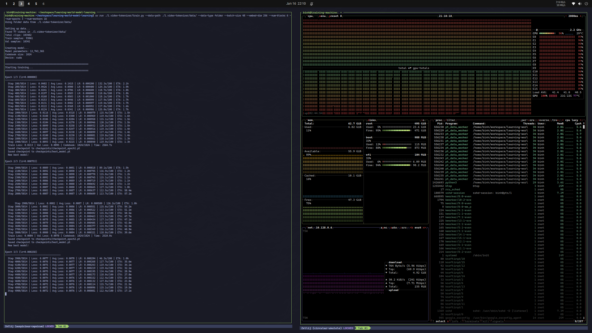
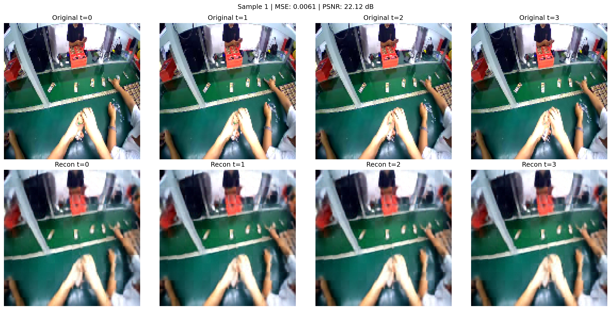
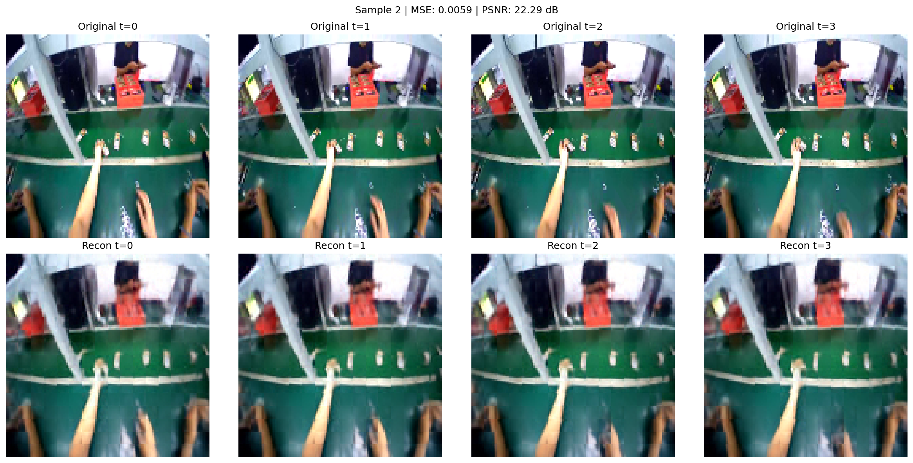
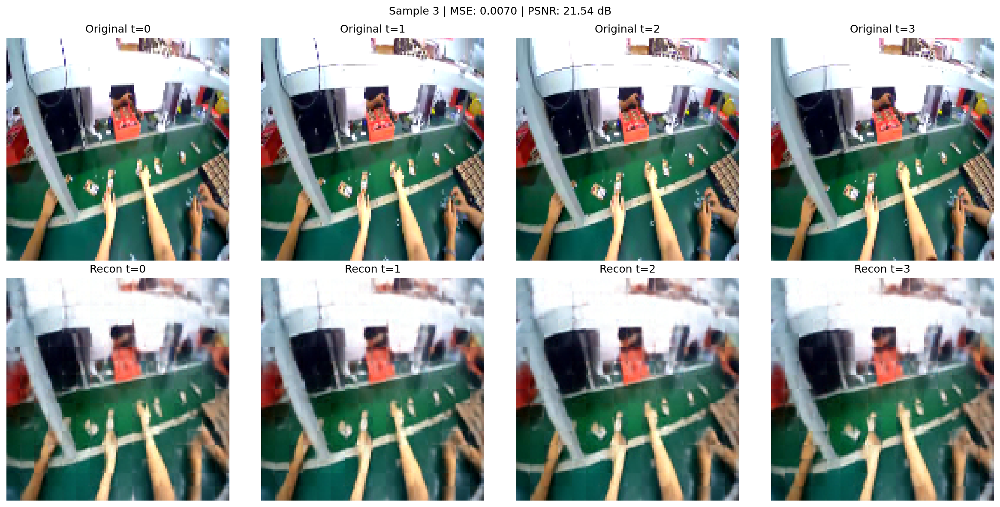
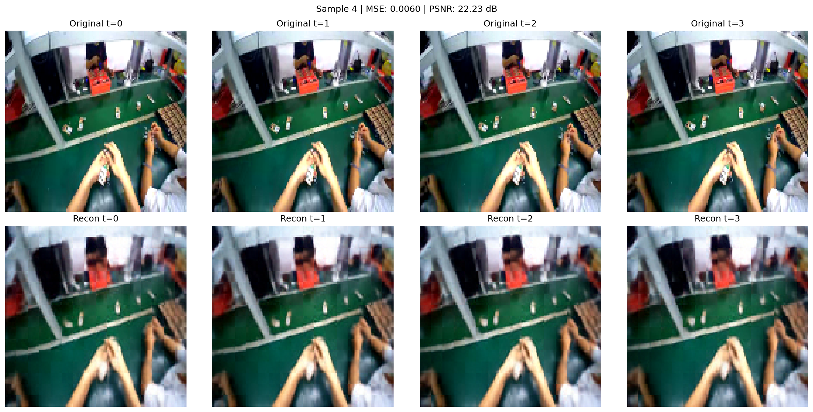
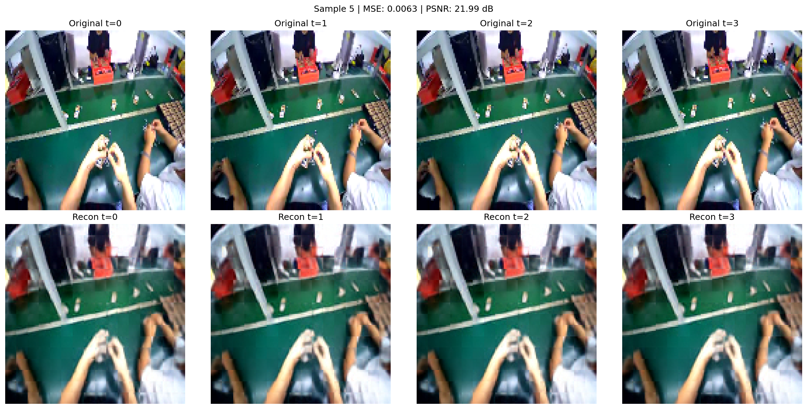
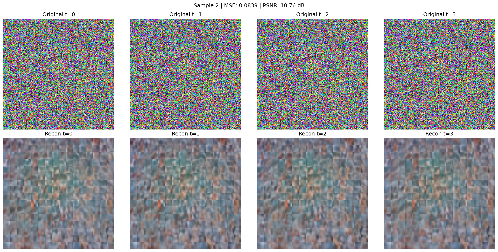
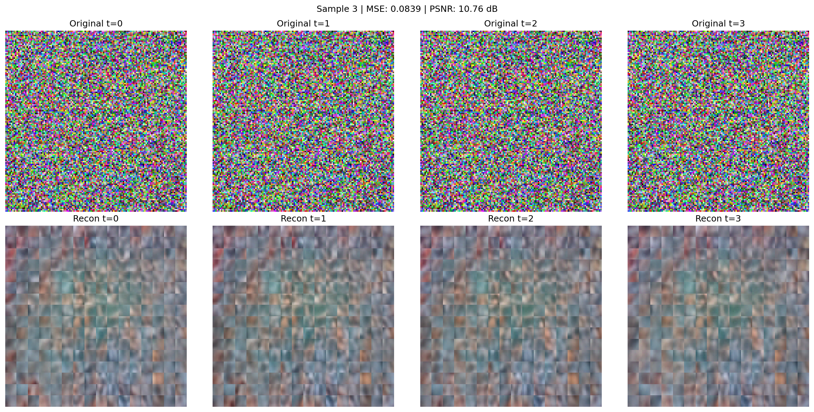
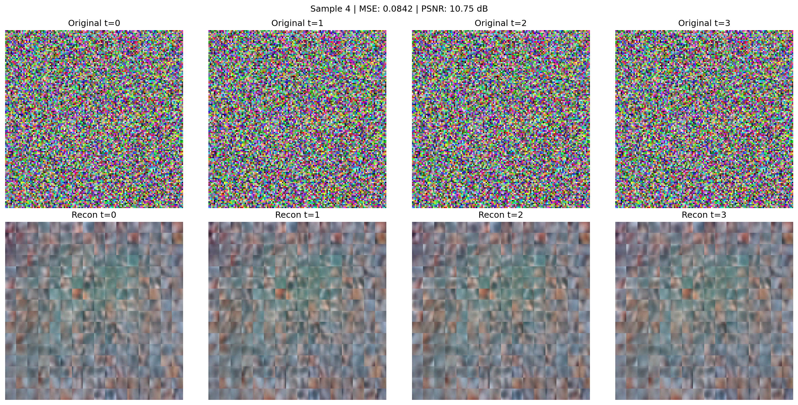

# 1. Video Tokenizer

In language models, we convert text into tokens - discrete integers that the model can process. A sentence like "Hello world" becomes something like `[15496, 995]`. This works because language is inherently discrete.

But video is continuous. A single 128×128 RGB frame has 49,152 floating point values. How do we convert this into discrete tokens that a transformer can process?

This is the problem the video tokenizer solves.

## The Problem

We want to build a world model that predicts future video frames. But feeding raw pixels to a transformer is problematic:

1. **Too high dimensional**: A 128×128×3 frame = 49,152 values. Processing 4 frames means 196,608 values per sample.
2. **Continuous values**: Transformers work best with discrete tokens (like in language models).
3. **No semantic structure**: Pixels don't capture meaning - a slight shift in lighting changes all pixel values but the scene is the same.

## The Questions

Out of first principles, to tokenize a video we need to answer:

1. **How do we reduce the dimensionality?** We can't process 49,152 values per frame efficiently.
2. **How do we learn relationships between parts of a frame?** Pixels in a patch need to "know" about other patches.
3. **How do we learn relationships across time?** Frame 3 should "know" what happened in frames 1 and 2.
4. **How do we preserve position information?** A patch at the top-left should "know" it's at the top-left.
5. **How do we discretize?** Continuous values need to become discrete tokens.
6. **How do we reconstruct pixels from tokens?** We need to decode back to frames for training.

## The Solutions

### 1. Reducing dimensionality with patch embedding

Instead of processing individual pixels, we divide each frame into patches. A 128×128 frame with 8×8 patches = 16×16 = 256 patches. Each patch is projected to a 128-dimensional vector.

This is exactly what Vision Transformer (ViT) does. The intuition: a small patch of an image (8×8 = 64 pixels) can be summarized by a single vector that captures "what's in this patch."

From [models/patch_embed.py](models/patch_embed.py):

```python
class PatchEmbedding(nn.Module):
    def __init__(self, in_channels=3, embed_dim=128, patch_size=8, frame_size=128):
        # Projection layer: Conv2D with kernel=stride=patch_size
        # This extracts non-overlapping patches and projects them in one step
        self.proj = nn.Conv2d(
            in_channels=in_channels,
            out_channels=embed_dim,
            kernel_size=patch_size,
            stride=patch_size,
        )

    def forward(self, x):
        # x: (B, T, C, H, W) - batch, time, channels, height, width
        B, T, C, H, W = x.shape
        x = x.view(B * T, C, H, W)
        x = self.proj(x)  # (B*T, E, H/P, W/P) = (B*T, 128, 16, 16)
        x = x.flatten(start_dim=2).transpose(1, 2)  # (B*T, 256, 128)
        return x.view(B, T, 256, 128)  # (B, T, N, E)
```

The key insight: a Conv2D with `kernel_size=stride=patch_size` extracts non-overlapping patches and projects them in a single operation. We go from 49,152 values per frame to 256 patch embeddings.

### 2. Learning spatial relationships with self-attention

Now we have 256 patch embeddings per frame. But each patch was processed independently - the top-left patch doesn't know anything about the bottom-right patch. We need patches to communicate.

This is what **self-attention** does. Each patch looks at all other patches and computes a weighted sum based on relevance. "How much should I pay attention to each other patch?"

From [models/st_transformer.py](models/st_transformer.py):

```python
class MultiHeadAttention(nn.Module):
    def forward(self, x):
        # x: (B, S, E) - batch, sequence length, embedding dim

        # Project to queries, keys, values
        q = self.q_proj(x)  # What am I looking for?
        k = self.k_proj(x)  # What do I contain?
        v = self.v_proj(x)  # What information do I have?

        # Attention scores: how relevant is each position to each other position?
        # scores[i,j] = how much should position i attend to position j
        scores = (q @ k.transpose(-2, -1)) / sqrt(head_dim)
        attn_weights = softmax(scores, dim=-1)

        # Weighted sum of values
        output = attn_weights @ v
        return output
```

For **spatial attention**, we process each frame independently. The 256 patches within a frame attend to each other:

```python
# Reshape: (B, T, N, E) -> (B*T, N, E)
# Now each of the B*T frames is a separate sequence of N=256 patches
x = x.view(B * T, N, E)
x = self.spatial_attention(x)  # Patches attend to each other within frame
x = x.view(B, T, N, E)
```

### 3. Learning temporal relationships with causal attention

Spatial attention lets patches within a frame communicate. But frames also need to communicate with each other. "What happened before me?"

For **temporal attention**, we flip the axes. Instead of 256 patches attending within a frame, we have each patch position attending across T frames:

```python
# Reshape: (B, T, N, E) -> (B*N, T, E)
# Now each of the B*N patch positions is a separate sequence of T frames
x = x.permute(0, 2, 1, 3).view(B * N, T, E)
x = self.temporal_attention(x, mask=causal_mask)  # Frames attend across time
x = x.view(B, N, T, E).permute(0, 2, 1, 3)
```

Temporal attention is **causal** - frame 3 can see frames 1, 2, 3 but NOT frame 4. We enforce this with a mask:

```python
def create_causal_mask(seq_len):
    # mask[i,j] = True means position i CANNOT attend to position j
    # Upper triangular = can't see the future
    #     [0, 1, 1, 1]   Frame 0 can only see frame 0
    #     [0, 0, 1, 1]   Frame 1 can see frames 0, 1
    #     [0, 0, 0, 1]   Frame 2 can see frames 0, 1, 2
    #     [0, 0, 0, 0]   Frame 3 can see all frames
    return torch.triu(torch.ones(seq_len, seq_len), diagonal=1).bool()
```

Why causal? During world model inference, we only have past frames. If the encoder could see the future during training, it would learn to cheat.

### 4. Combining spatial and temporal: the Spatio-Temporal Transformer

We combine spatial attention + temporal attention + a feed-forward network into a single block, then stack multiple blocks:

```python
class SpatioTemporalBlock(nn.Module):
    def forward(self, x, causal_mask):
        # x: (B, T, N, E)

        # 1. Spatial attention (within each frame)
        x = x + self.spatial_attention(x)

        # 2. Temporal attention (across frames, causal)
        x = x + self.temporal_attention(x, mask=causal_mask)

        # 3. Feed-forward network (process each token independently)
        x = x + self.feed_forward(x)

        return x

class SpatioTemporalTransformer(nn.Module):
    def __init__(self, num_blocks=4, causal_temporal=True):
        self.blocks = [SpatioTemporalBlock() for _ in range(num_blocks)]
        self.causal_temporal = causal_temporal

    def forward(self, x):
        mask = create_causal_mask(T) if self.causal_temporal else None
        for block in self.blocks:
            x = block(x, mask)
        return x
```

**Important clarification**: `SpatioTemporalTransformer` is just a stack of self-attention blocks. It is NOT an encoder-decoder transformer with cross-attention. We'll use the same structure in both our encoder and decoder (with different weights and different causal settings).

### 5. Preserving position with positional encoding

Attention is permutation-invariant - shuffling the input order gives the same output (just shuffled). We need to tell the model where each patch is located.

We add **positional encoding** - a fixed signal that encodes position. We use sinusoidal encoding:

```
PE(pos, 2i)   = sin(pos / 10000^(2i/d))
PE(pos, 2i+1) = cos(pos / 10000^(2i/d))
```

Different frequencies capture different scales. Low frequencies distinguish "left vs right", high frequencies distinguish "this pixel vs neighboring pixel."

From [models/positional_encoding.py](models/positional_encoding.py):

```python
class SpatioTemporalPositionalEncoding(nn.Module):
    def __init__(self, embed_dim=128, grid_size=16, max_frames=32):
        # Split embedding into spatial (x, y) and temporal (t)
        # 2/3 for spatial, 1/3 for temporal
        self.spatial_dim = (embed_dim * 2) // 3  # ~85 dims for x,y
        self.temporal_dim = embed_dim - self.spatial_dim  # ~43 dims for t

        self.pe_x = SinusoidalPE(self.spatial_dim // 2)  # x position
        self.pe_y = SinusoidalPE(self.spatial_dim // 2)  # y position
        self.pe_t = SinusoidalPE(self.temporal_dim)       # time position

    def forward(self, x):
        # Add position info to each patch embedding
        # x: (B, T, N, E) -> same shape, but now encodes position
        x[:, :, :, :spatial_dim] += spatial_encoding  # x, y position
        x[:, :, :, spatial_dim:] += temporal_encoding  # t position
        return x
```

### 6. Discretizing with Finite Scalar Quantization (FSQ)

After the transformer, we have continuous embeddings. We need discrete tokens.

The classic approach is **VQ-VAE**: learn a codebook of vectors, find the nearest neighbor for each embedding. But VQ-VAE suffers from codebook collapse (some tokens never get used).

**FSQ** is simpler: just round each dimension to a finite set of values.

From [models/fsq.py](models/fsq.py):

```python
class FiniteScalarQuantizer(nn.Module):
    def __init__(self, latent_dim=5, num_bins=4):
        # codebook_size = num_bins^latent_dim = 4^5 = 1024 tokens
        self.latent_dim = latent_dim
        self.num_bins = num_bins

    def forward(self, z):
        # z: (B, T, N, D) where D = latent_dim = 5

        # Step 1: Bound values to [-1, 1]
        z_bounded = torch.tanh(z)

        # Step 2: Scale to [0, num_bins-1] and round
        z_scaled = (z_bounded + 1) / 2 * (self.num_bins - 1)
        z_rounded = torch.round(z_scaled)  # Values in {0, 1, 2, 3}

        # Step 3: Straight-through estimator (STE)
        # Forward: use rounded values
        # Backward: pretend rounding didn't happen (gradients flow through)
        z_q = z_scaled + (z_rounded - z_scaled).detach()

        # Step 4: Convert 5 values to single index
        # [2, 1, 0, 3, 1] -> 2*1 + 1*4 + 0*16 + 3*64 + 1*256 = 454
        indices = (z_rounded * self.basis).sum(dim=-1)

        return z_q, indices  # indices are integers in [0, 1023]
```

With `latent_dim=5` and `num_bins=4`, we get 4^5 = 1024 possible tokens - a vocabulary comparable to a small text tokenizer.

### 7. Reconstructing frames with pixel shuffle

Now we need to decode tokens back to pixels. The decoder mirrors the encoder:

1. Project from latent dim (5) back to embedding dim (128)
2. Add positional encoding
3. Run through SpatioTemporalTransformer (non-causal this time - we can see all frames)
4. Convert patch embeddings back to pixels

The tricky part is step 4. We have 256 embeddings of size 128 and need a 128×128×3 image.

Naive approach: reshape each embedding to 8×8×3 pixels. But this creates blocky artifacts at patch boundaries.

Better approach: **pixel shuffle**. Project each embedding to 192 values (3 channels × 64 positions), arrange in a 16×16 grid with 192 channels, then "shuffle" channels into spatial dimensions:

From [models/patch_embed.py](models/patch_embed.py):

```python
class PatchUnembedding(nn.Module):
    def __init__(self, embed_dim=128, out_channels=3, patch_size=8):
        # Project each patch embedding to C * P^2 values
        self.proj = nn.Linear(embed_dim, out_channels * patch_size**2)  # 128 -> 192

        # PixelShuffle: (*, C*r^2, H, W) -> (*, C, H*r, W*r)
        self.pixel_shuffle = nn.PixelShuffle(upscale_factor=patch_size)

    def forward(self, x):
        # x: (B, T, N, E) = (B, T, 256, 128)
        x = self.proj(x)  # (B, T, 256, 192)

        # Reshape to 16x16 grid with 192 channels
        x = x.view(B*T, 16, 16, 192).permute(0, 3, 1, 2)  # (B*T, 192, 16, 16)

        # Pixel shuffle: (B*T, 192, 16, 16) -> (B*T, 3, 128, 128)
        x = self.pixel_shuffle(x)

        return x.view(B, T, 3, 128, 128)
```

The network learns to distribute pixel values across channels in a way that produces smooth reconstructions.

## The Architecture

Now that we've explained each component, here's how they fit together:

```
                              ENCODER
┌─────────────────────────────────────────────────────────────────┐
│                                                                 │
│  Video Frames ──► Patch Embed ──► + Pos Enc ──► ST-Transformer ─┼──► Linear ──► FSQ
│  (B,T,3,128,128)  (B,T,256,128)   (B,T,256,128)  (B,T,256,128)  │   (B,T,256,5)   ▼
│                                   [solution 5]   [solutions 2-4]│               ┌────────┐
└─────────────────────────────────────────────────────────────────┘               │ Tokens │
    [solution 1]                                                                  │(B,T,256)│
                              DECODER                                             └────┬───┘
┌─────────────────────────────────────────────────────────────────┐                    │
│                                                                 │    [solution 6]    ▼
│  Reconstructed ◄── Pixel Shuffle ◄── ST-Transformer ◄── + Pos ─┼─◄── Linear ◄── z_q
│  (B,T,3,128,128)   (B,T,256,128)     (B,T,256,128)       Enc    │   (B,T,256,128)
│                    [solution 7]      [non-causal]               │
└─────────────────────────────────────────────────────────────────┘

Training: minimize MSE(Video Frames, Reconstructed)
```

**Why do encoder and decoder both have their own ST-Transformer?**

This is an **autoencoder**, not a seq2seq model:

```
Seq2seq (e.g., translation):
  Encoder: "Hello" → [hidden states]
                          ↓ cross-attention (decoder looks at encoder output)
  Decoder: [hidden states] → "Bonjour"

Autoencoder (what we're doing):
  Encoder: frames → [bottleneck: discrete tokens]
                          ↓ just pass the tokens through (no cross-attention)
  Decoder: [tokens] → reconstructed frames
```

There's no cross-attention. The encoder and decoder only communicate through the **bottleneck** (the discrete tokens). Both use the same `SpatioTemporalTransformer` class but with:

| | Encoder's Transformer | Decoder's Transformer |
|---|---|---|
| Temporal attention | Causal (can't see future) | Non-causal (sees all) |
| Weights | Learned independently | Learned independently |
| Cross-attention | None | None |

## Dimensions Reference

| Symbol | Meaning | Default |
|--------|---------|---------|
| B | Batch size | 8 |
| T | Number of frames | 4 |
| C | Channels (RGB) | 3 |
| H, W | Frame height/width | 128 |
| P | Patch size | 8 |
| N | Patches per frame = (H/P)² | 256 |
| E | Embedding dimension | 128 |
| D | Latent dimensions (FSQ) | 5 |
| L | Bins per dimension (FSQ) | 4 |

## Usage

```bash

# Train with dummy data (sanity check)
uv run python train.py --use-dummy-data --num-epochs 10

# Train with video folder
uv run python train.py --data-path /path/to/videos --data-type folder

# Validate and visualize
uv run python validate.py --checkpoint checkpoints/best_model.pt --save-images
```

## What to look for

During training:
- **Loss should decrease** - if it doesn't, learning rate might be wrong
- **Codebook usage should be high** - all 1024 tokens should eventually be used
- **Validation should track training** - if val loss diverges, you're overfitting

During validation:
- **PSNR > 25 dB** - reasonable quality
- **PSNR > 30 dB** - good quality
- **Codebook usage > 90%** - efficient use of vocabulary

## Files

```
1.video-tokenizer/
├── README.md                           # This file
├── config.py                           # Hyperparameters
├── data_utils.py                       # Dataset classes
├── train.py                            # Training loop
├── validate.py                         # Evaluation
├── models/
│   ├── video_tokenizer.py              # Main model
│   ├── fsq.py                          # Finite Scalar Quantization
│   ├── st_transformer.py               # Spatio-Temporal Transformer
│   ├── patch_embed.py                  # Patch Embedding
│   └── positional_encoding.py          # Positional Encoding
├── checkpoints/                        # Saved models
└── data/                               # Datasets
```

## Run Log

To validate the model, I used egocentric videos (`factory001/worker001/part000.tar`) from [BuildAI's egocentric video dataset](https://huggingface.co/datasets/builddotai/Egocentric-100K).

There are a total of 77 videos at 30fps totaling a duration of 13789s ~= 3.83hr. The resolution for each video is 456x256, which is then resized to 128x128 using opencv.resize's default interpolation.

For compute, I used a spot L4 GPU (24GB VRAM) isntance on GCP with 16 cpu cores. The following parameters were used:

```
  uv run ./1.video-tokenizer/train.py \
    --data-path ./1.video-tokenizer/data/ \
    --data-type folder \
    --batch-size 48 \
    --embed-dim 256 \
    --num-blocks 6 \
    --num-epochs 3 \
    --num-workers 16
```

The output of such command is here for reference:

```
Using folder data from ./1.video-tokenizer/data/

Setting up data...
Found 77 videos in ./1.video-tokenizer/data/
Total clips: 103402
Train samples: 93061
Val samples: 10341

Creating model...
Model parameters: 12,743,365
Codebook size: 1024
Device: cuda
```



It costs me roughly 2.1 hours to train. The checkpoints can be found in `checkpoints/`.

For validation, the following command is used:

```
uv run python validate.py --checkpoint checkpoints/best_model.pt --data-path ./data --data-type folder --save-images --nubatches 5 --num-samples 5
```

Reconstruction quality on real video frames from the validation set (PSNR ~22 dB):

| | | | | |
|---|---|---|---|---|
|  |  |  |  |  |

What happens when we feed random noise through the tokenizer? The decoder produces blurry, averaged outputs since noise doesn't map to meaningful tokens:

| | | | | |
|---|---|---|---|---|
|  |  |  |  |  |

### Using the Checkpoints

The checkpoint files are stored using Git LFS. To download them:

```bash
# Install git-lfs if you haven't already
# Ubuntu/Debian: sudo apt install git-lfs
# macOS: brew install git-lfs

# Initialize git-lfs and pull the files
git lfs install
git lfs pull
```

**Security note:** PyTorch checkpoint files (`.pt`) use pickle serialization, which can execute arbitrary code when loaded. Only load checkpoints from sources you trust. The code uses `weights_only=False` in `torch.load()` to load the config object stored alongside the weights.

You can validate and visualize the model with the following command:

```bash
uv run python validate.py --checkpoint checkpoints/best_model.pt --data-path ./data --save-images
```

## Disclaimer/Improvements

This implementation is not built for speed. A few improvements come to mind:

[ ] Pre-process Video: The Dataloader decodes videos on the fly. This bottlenecks the training as the GPU needs to wait for the CPU on every step.
[ ] Kernel Optimization: We still use vanilla attention and kernels. Speed can improve significantly by kernels such as FlashAttention.

I recommend implementing these yourself to learn.

## What's next?

Now that we can tokenize video frames into discrete tokens, the next question is: **how do we predict future tokens?**

Given the tokens for frames 1-4 and an action, can we predict the tokens for frame 5? This is what the dynamics model does - covered in `2.dynamics-model/`.

## References

- [Genie: Generative Interactive Environments](https://arxiv.org/abs/2402.15391)
- [Language Model Beats Diffusion - Tokenizer is Key](https://arxiv.org/abs/2310.05737) (FSQ paper)
- [Attention Is All You Need](https://arxiv.org/abs/1706.03762)
- [An Image is Worth 16x16 Words](https://arxiv.org/abs/2010.11929) (ViT)
