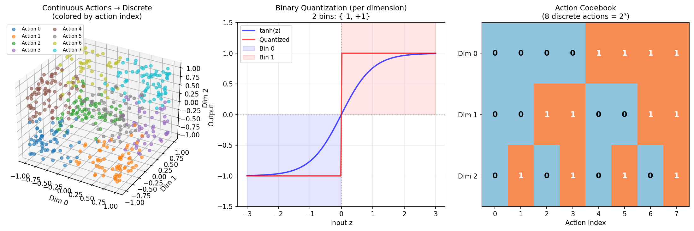
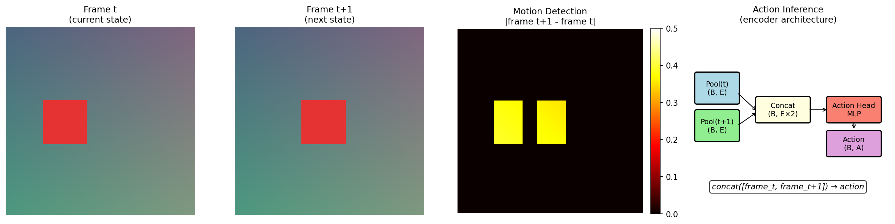
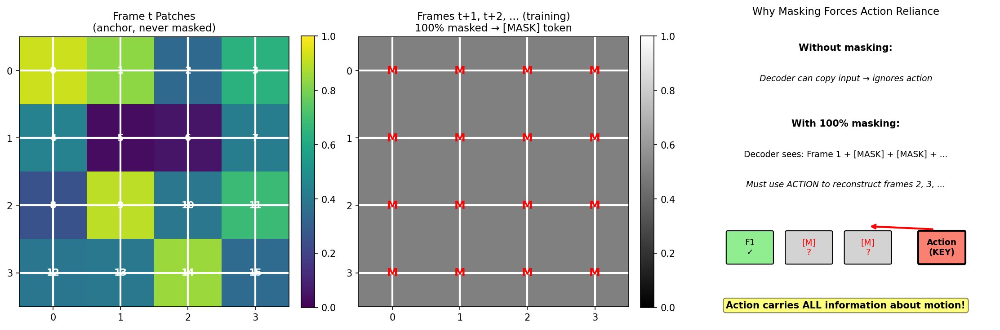
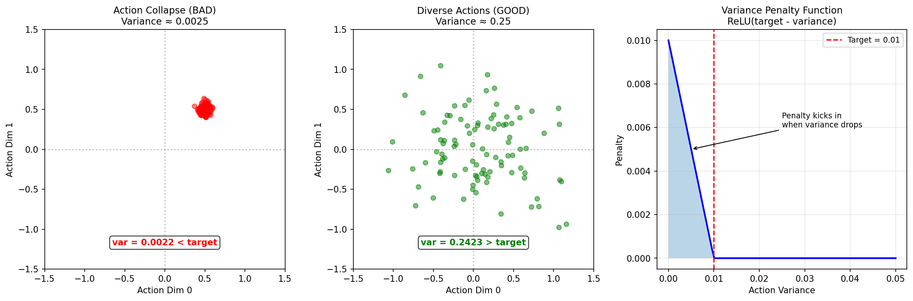
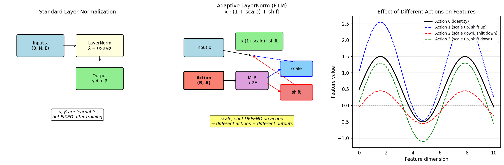
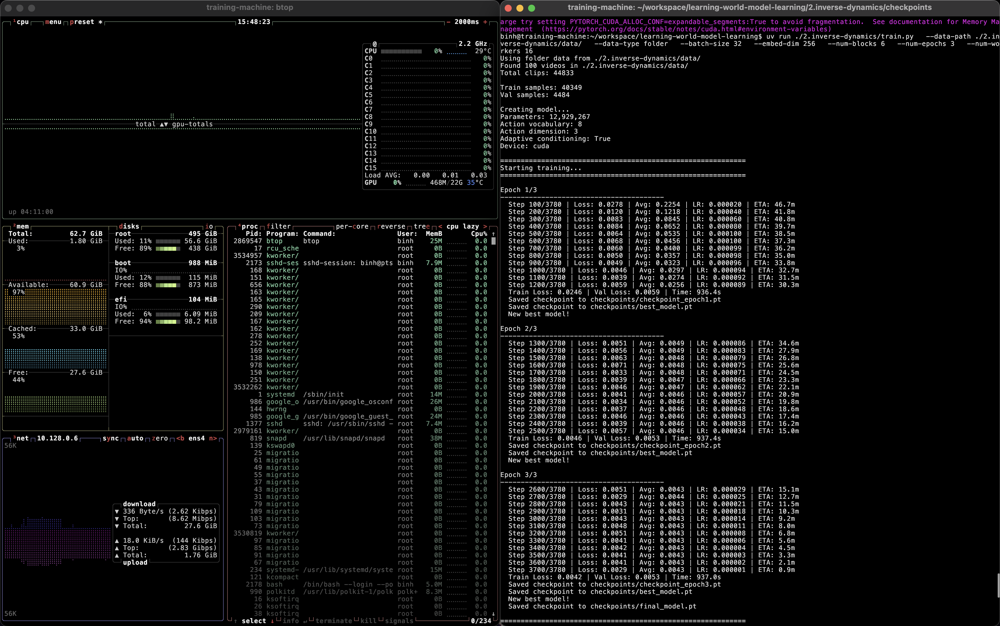
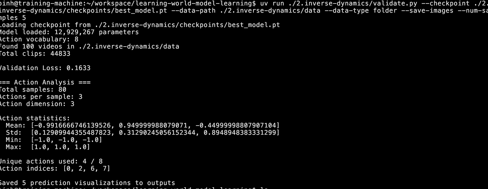
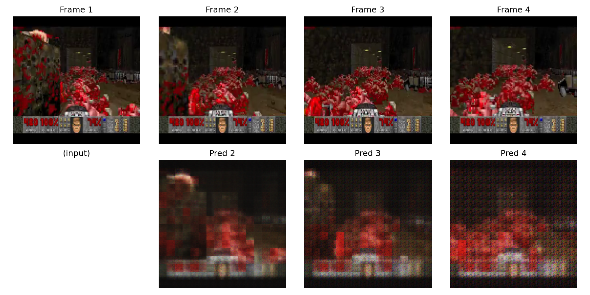
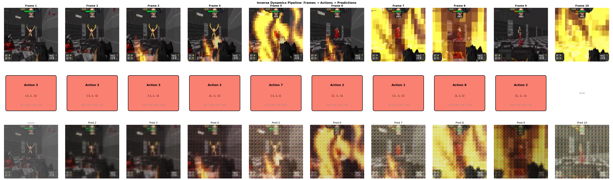

# 2. Inverse Dynamics

The second question we are going to answer in this repository is **how to get actions for training a world model**.

Recall the definition of a world model: given the current state and action, predict the next state. Getting the current state is straightforward: it's just the video frame, which we learned to tokenize in [folder 1](../1.video-tokenizer/README.md). But where do we get actions from?

Consider training a world model on YouTube videos. We have millions of hours of video showing people walking, cars driving, objects moving. But we don't have labels for what "actions" caused these movements. Without action labels, how can we train a model that takes `(state, action) → next_state`?

The key insight from [Genie](https://arxiv.org/abs/2402.15391) is elegant: **learn the actions themselves**. If we can train a model to infer what action happened between frames, we can use those inferred actions to train the dynamics model.

This process of inferring actions from frame transitions is called **inverse dynamics**. In physics, dynamics describes how forces cause motion. Inverse dynamics reverses this: given the motion, what forces caused it? In world models: **given frame t and frame t+1, what action caused this transition?**

## The Problem

The naive approaches to get actions don't work well:

1. **Ignore actions entirely**: Just predict the next frame from the current frame. But then the model can't be controlled. It will hallucinate its own "actions" and we lose the ability to interact with the world.
2. **Manual labeling**: Have humans label each frame transition with actions. Prohibitively expensive and doesn't scale to millions of videos.
3. **Use controller inputs**: Only works for games or simulations where we can record inputs. Doesn't work for real-world video.

The solution is to learn a model that looks at two consecutive frames and outputs what action happened between them. But this raises new questions: what is an "action" anyway? How do we represent it? How do we train such a model without ground truth labels?

Assuming you have a transformer and FSQ from [folder 1](../1.video-tokenizer/README.md), take 5 minutes before continuing to think: how would you build this inverse dynamics model? What questions need answers?

## The Questions

Out of first principles, to build an inverse dynamics model, we need to answer:

1. **How do we represent video frames?** We need a compact representation suitable for a neural network.
2. **How do we represent actions?** What form should an "action" take? Continuous vectors? Discrete tokens?
3. **How do we infer actions from frame pairs?** What architecture looks at two frames and outputs an action?
4. **How do we train without ground truth actions?** We don't have action labels to supervise with.
5. **How do we ensure actions are meaningful?** Models can easily ignore actions entirely.

## The Solutions

### 1. How do we represent video frames?

This problem was solved in [folder 1](../1.video-tokenizer/README.md). We convert a video frame `(H, W, 3)` into patch embeddings `(N, E)` where N is the number of patches and E is the embedding dimension.

For a 128×128 frame with 8×8 patches, we get `(128/8)² = 256` patches, each represented by a 128-dimensional vector. These embeddings capture what's in each patch and where it is (via positional encoding).

The inverse dynamics model reuses the same `PatchEmbedding` and `SpatioTemporalTransformer` from folder 1:

```python
# From inverse_dynamics/models/latent_action_model.py
from video_tokenizer import (
    PatchEmbedding,
    SpatioTemporalTransformer,
    FiniteScalarQuantizer,
    SpatioTemporalPositionalEncoding,
)
```

### 2. How do we represent actions?

In video games, actions are controller inputs: move left, jump, shoot. These can be discrete (button presses) or continuous (joystick position). But in real-world video, actions are much more nuanced. How do you label what "action" caused a person to shift their weight slightly?

The insight is to use **latent actions**. We don't define what actions mean; we let the model learn them. The model outputs a vector, and we discretize it into a finite vocabulary of actions using FSQ (Finite Scalar Quantization) from folder 1.

For example, with `action_dim=3` dimensions and binary quantization (2 bins per dimension):

- `2³ = 8` possible discrete actions
- Action `[0, 0, 0]` maps to action 0 (the model learns this might mean "stay still")
- Action `[1, 0, 1]` maps to action 5 (the model learns this might mean "move forward")
- Action `[1, 1, 1]` maps to action 7 (the model learns this might mean "turn right")

We don't define the semantics. They emerge from training.

From [inverse_dynamics/models/latent_action_model.py](inverse_dynamics/models/latent_action_model.py):

```python
class LatentActionModel(nn.Module):
    NUM_LATENT_ACTIONS_BINS = 2  # Binary quantization: {0, 1}

    def __init__(self, n_actions: int = 8, ...):
        # n_actions must be power of 2: n_actions = 2^action_dim
        # For n_actions=8: action_dim = log2(8) = 3
        self.action_dim = int(math.log(n_actions, self.NUM_LATENT_ACTIONS_BINS))

        # Quantizer discretizes continuous action vectors to finite vocabulary
        # Input: (B, T-1, 3) continuous values
        # Output: (B, T-1, 3) values in {0, 1}, representing 8 discrete actions
        self.quantizer = FiniteScalarQuantizer(
            latent_dim=self.action_dim,    # 3 dimensions
            num_bins=self.NUM_LATENT_ACTIONS_BINS,  # Binary: 2 bins
        )
```

Why binary quantization? It's the simplest form: each dimension is either 0 or 1. With 3 dimensions, we get 8 actions. Want more actions? Increase `action_dim`: with 4 dimensions, `2⁴ = 16` actions.



### 3. How do we infer actions from frame pairs?

Now the core architecture question: given frames at time t and t+1, how do we predict the action that caused this transition?

The encoder processes all frames through a spatio-temporal transformer, then extracts actions by comparing adjacent frame representations:

From [inverse_dynamics/models/latent_action_model.py](inverse_dynamics/models/latent_action_model.py):

```python
class LatentActionsEncoder(nn.Module):
    def forward(self, frames: torch.Tensor) -> torch.Tensor:
        """
        Args:
            frames: (B, T, C, H, W) - batch of video clips

        Returns:
            actions: (B, T-1, A) - one action per frame transition
        """
        batch_size, seq_len, C, H, W = frames.shape

        # Step 1: Convert frames to patch embeddings
        # (B, T, 3, 128, 128) -> (B, T, 256, 128)
        embeddings = self.patch_embed(frames)

        # Step 2: Add positional encoding (where is each patch, which frame)
        embeddings = self.pos_encoding(embeddings)

        # Step 3: Apply spatio-temporal transformer
        # Patches attend to each other within frames (spatial)
        # Patches attend to same position across frames (temporal, causal)
        transformed = self.transformer(embeddings)  # (B, T, N, E)

        # Step 4: Mean pool over patches to get one vector per frame
        # (B, T, 256, 128) -> (B, T, 128)
        pooled = transformed.mean(dim=2)

        # Step 5: For each adjacent pair, predict the action
        actions = []
        for t in range(seq_len - 1):
            # Concatenate frame t and frame t+1 representations
            combined = torch.cat([pooled[:, t], pooled[:, t + 1]], dim=1)  # (B, 256)
            # Project to action dimension
            action = self.action_head(combined)  # (B, A)
            actions.append(action)

        actions = torch.stack(actions, dim=1)  # (B, T-1, A)
        return actions
```

The key insight: by concatenating representations of adjacent frames, the model can learn what "changed" between them. The action head learns to summarize this change as a compact action vector.

The action head is a simple MLP:

```python
# Takes concatenated features from frame t and frame t+1
# (B, E*2) -> (B, A)
self.action_head = nn.Sequential(
    nn.LayerNorm(embed_dim * 2),       # Normalize 256-dim input
    nn.Linear(embed_dim * 2, 4 * action_dim),  # Expand: 256 -> 12
    nn.GELU(),
    nn.Linear(4 * action_dim, action_dim),     # Contract: 12 -> 3
)
```



### 4. How do we train without ground truth actions?

Here's the elegant part: we use **reconstruction** as the training signal. If our inferred actions are correct, we should be able to use them to predict the next frame.

The training loop:

1. Encoder sees frames `[f1, f2, f3, f4]`
2. Encoder outputs actions `[a1, a2, a3]` (one per transition)
3. Quantizer discretizes actions to finite vocabulary
4. Decoder takes frames `[f1, f2, f3]` + actions `[a1, a2, a3]`
5. Decoder predicts frames `[f2', f3', f4']`
6. Loss = difference between `[f2', f3', f4']` and actual `[f2, f3, f4]`

The decoder is the forward dynamics model: given current frame + action, predict next frame.

From [inverse_dynamics/models/latent_action_model.py](inverse_dynamics/models/latent_action_model.py):

```python
class LatentActionModel(nn.Module):
    def forward(self, frames: torch.Tensor):
        # 1. Infer continuous action latents from frame pairs
        action_latents = self.encoder(frames)  # (B, T-1, A)

        # 2. Quantize to discrete actions (with straight-through gradient)
        action_latents_quantized, _ = self.quantizer(action_latents)

        # 3. Predict next frames using inferred actions
        pred_frames = self.decoder(frames, action_latents_quantized, training=True)

        # 4. Compute reconstruction loss
        target_frames = frames[:, 1:]  # Ground truth: frames 2 to T
        recon_loss = F.smooth_l1_loss(pred_frames, target_frames)

        return recon_loss, pred_frames
```

We never need ground truth actions. The model learns to infer actions that are **useful for prediction**. Actions that don't help prediction get zero gradient and are not learned.

### 5. How do we ensure actions are meaningful?

This is the key challenge. Without any constraint, the decoder might:

- Ignore the action entirely and just copy the input frame
- Predict the "average" next frame regardless of action
- Collapse all actions to the same value

Two techniques prevent this:

**Technique 1: Aggressive token masking**

During training, we mask almost all input tokens in the decoder. The decoder only sees:

- The first frame (as an anchor)
- The action conditioning

This forces the action to carry the information about what happened. If the action were meaningless, the decoder couldn't reconstruct the target frame.

From [inverse_dynamics/models/latent_action_model.py](inverse_dynamics/models/latent_action_model.py):

```python
class LatentActionsDecoder(nn.Module):
    def forward(self, frames, actions, training=True):
        # ... patch embedding and positional encoding ...

        # Mask tokens during training to force reliance on actions
        if training and self.training:
            keep_rate = 0.0  # Mask ALL tokens
            keep = torch.rand(B, seq_len, self.num_patches, 1, device=frames.device) < keep_rate
            keep[:, 0] = True  # Never mask first frame (anchor point)
            video_embeddings = torch.where(
                keep,
                video_embeddings,
                self.mask_token.expand_as(video_embeddings),  # Replace with learnable mask
            )
```

Why keep the first frame? The decoder needs some reference point. The first frame provides context (what scene are we in?), and the action tells us how that scene changes.



**Technique 2: Variance penalty**

To prevent action collapse (where the encoder predicts the same action for everything), we add a variance penalty:

```python
# Encourage diversity in predicted actions
# If all actions collapse to the same value, variance goes to 0
z_var = action_latents.var(dim=0, unbiased=False).mean()  # Variance across batch
var_penalty = F.relu(self.var_target - z_var)  # Penalize if below target

total_loss = recon_loss + self.var_lambda * var_penalty
```

If the variance of actions drops below a target threshold, the penalty kicks in, pushing the model to produce diverse actions.



### 6. How does the decoder condition on actions?

The decoder needs to use the action to guide its prediction. We use two complementary conditioning approaches:

**Approach 1: Additive conditioning (coarse-grained)**

Project the action to the embedding dimension and add it to all patch embeddings:

```python
# Action conditioning projection
# (B, T-1, A) -> (B, T-1, E)
action_embed = self.action_proj(actions)

# Expand to all patches: (B, T-1, E) -> (B, T-1, N, E)
action_embed = action_embed.unsqueeze(2).expand(-1, -1, self.num_patches, -1)

# Add to video embeddings
video_embeddings = video_embeddings + action_embed
```

This gives all patches a global "hint" about what action is happening.

**Approach 2: Adaptive layer normalization (fine-grained)**

For deeper conditioning, we use FiLM (Feature-wise Linear Modulation) in each transformer layer. The action generates scale and shift parameters that modulate the layer normalization.

From [video_tokenizer/models/st_transformer.py](../1.video-tokenizer/video_tokenizer/models/st_transformer.py):

```python
class AdaptiveRMSNorm(nn.Module):
    """
    FiLM modulation: normalized_x * (1 + scale) + shift
    where scale and shift are generated from the action vector
    """
    def __init__(self, dim: int, conditioning_dim: Optional[int] = None):
        if conditioning_dim is not None:
            # MLP generates shift and scale from action
            self.conditioning_mlp = nn.Sequential(
                nn.SiLU(),
                nn.Linear(conditioning_dim, dim * 2, bias=True),
            )
            # Zero initialization: start as identity, learn to modulate
            nn.init.constant_(self.conditioning_mlp[-1].weight, 0)
            nn.init.constant_(self.conditioning_mlp[-1].bias, 0)

    def forward(self, x, conditioning=None):
        # Standard RMS normalization
        x_norm = (x / rms) * self.scale

        if conditioning is not None:
            shift, scale = self.conditioning_mlp(conditioning).chunk(2, dim=-1)
            # Apply FiLM: modulate the normalized features
            x_norm = x_norm * (1 + scale) + shift

        return x_norm
```

The zero initialization is crucial: at the start of training, `scale=0` and `shift=0`, so the modulation is identity. The network gradually learns how to use the action conditioning.

The decoder transformer receives the action conditioning at every layer:

```python
class LatentActionsDecoder(nn.Module):
    def __init__(self, ..., use_adaptive_conditioning: bool = True):
        # Transformer with adaptive layer norm conditioning
        self.transformer = SpatioTemporalTransformer(
            embed_dim=embed_dim,
            num_heads=num_heads,
            num_blocks=num_blocks,
            causal_temporal=False,  # Can see all frames when decoding
            conditioning_dim=action_dim if use_adaptive_conditioning else None,
        )

    def forward(self, frames, actions, training=True):
        # ... masking and additive conditioning ...

        # Mean pool actions for conditioning: (B, T-1, A) -> (B, A)
        action_conditioning = actions.mean(dim=1)

        # Transformer receives action conditioning at every layer
        transformed = self.transformer(video_embeddings, conditioning=action_conditioning)
```



## The Architecture

```
                           ENCODER (Inverse Dynamics)
┌──────────────────────────────────────────────────────────────────────────┐
│                                                                          │
│  Frames ──► Patch Embed ──► + Pos Enc ──► ST-Transformer ──► Mean Pool  │
│  (B,T,3,H,W)  (B,T,N,E)     (B,T,N,E)    (B,T,N,E)         (B,T,E)      │
│                                                                  │       │
│                                              ┌───────────────────┘       │
│                                              ▼                           │
│                              Action Head: concat(frame_t, frame_t+1)     │
│                                              │                           │
└──────────────────────────────────────────────┼───────────────────────────┘
                                               ▼
                                    Continuous Actions (B, T-1, A)
                                               │
                                               ▼
                                          ┌─────────┐
                                          │   FSQ   │  Binary Quantization
                                          └────┬────┘
                                               ▼
                                    Discrete Actions (B, T-1, A)
                                               │
                           DECODER (Forward Dynamics)
┌──────────────────────────────────────────────┼───────────────────────────┐
│                                              ▼                           │
│  Frames[:-1] ──► Patch Embed ──► + Pos Enc ──► + Action Proj            │
│  (B,T-1,3,H,W)   (B,T-1,N,E)    (B,T-1,N,E)    (B,T-1,N,E)              │
│                                                    │                     │
│                                      [Token Masking during training]     │
│                                                    │                     │
│                                                    ▼                     │
│                              ST-Transformer (with action conditioning)   │
│                                                    │                     │
│                                                    ▼                     │
│                                              Frame Head                  │
│                                                    │                     │
│                                                    ▼                     │
│                                         Predicted Frames (B,T-1,3,H,W)   │
└──────────────────────────────────────────────────────────────────────────┘

Training: minimize reconstruction loss + variance penalty
```

## Dimensions Reference

| Symbol    | Meaning                    | Default |
| --------- | -------------------------- | ------- |
| B         | Batch size                 | 8       |
| T         | Number of frames           | 4       |
| C         | Channels (RGB)             | 3       |
| H, W      | Frame height/width         | 128     |
| P         | Patch size                 | 8       |
| N         | Patches per frame = (H/P)² | 256     |
| E         | Embedding dimension        | 128     |
| A         | Action dimension           | 3       |
| n_actions | Discrete vocabulary = 2^A  | 8       |

## Usage

All commands should be run from the **repository root** directory.

### Training

```bash
# Train with dummy data (sanity check)
uv run ./2.inverse-dynamics/train.py --use-dummy-data --num-epochs 10

# Train with video folder
uv run ./2.inverse-dynamics/train.py --data-path ./2.inverse-dynamics/data --data-type folder

# Train with more actions (16 = 2^4)
uv run ./2.inverse-dynamics/train.py --data-path ./2.inverse-dynamics/data --n-actions 16

# Disable adaptive conditioning (uses only additive conditioning)
uv run ./2.inverse-dynamics/train.py --data-path ./2.inverse-dynamics/data --no-adaptive-conditioning
```

### Validation

```bash
# Validate and analyze action distribution
uv run ./2.inverse-dynamics/validate.py \
  --checkpoint ./2.inverse-dynamics/checkpoints/best_model.pt \
  --data-path ./2.inverse-dynamics/data \
  --data-type folder \
  --save-images
```

### Infer Actions from Video

Extract the chain of predicted actions from any video:

```bash
# Basic usage - prints action sequence
uv run ./2.inverse-dynamics/debug/infer_actions.py \
  --checkpoint ./2.inverse-dynamics/checkpoints/best_model.pt \
  --video ./2.inverse-dynamics/data/sample.mp4

# Save to JSON
uv run ./2.inverse-dynamics/debug/infer_actions.py \
  --checkpoint ./2.inverse-dynamics/checkpoints/best_model.pt \
  --video ./2.inverse-dynamics/data/sample.mp4 \
  --output actions.json

# Process only first 100 frames, skip every 2nd frame
uv run ./2.inverse-dynamics/debug/infer_actions.py \
  --checkpoint ./2.inverse-dynamics/checkpoints/best_model.pt \
  --video ./2.inverse-dynamics/data/sample.mp4 \
  --max-frames 100 --frame-skip 2
```

### Interactive World Model Player

Play the world model interactively by pressing keys 1-8 to select actions:

```bash
# Start with first frame of a video
uv run ./2.inverse-dynamics/debug/play.py \
  --checkpoint ./2.inverse-dynamics/checkpoints/best_model.pt \
  --start-video ./2.inverse-dynamics/data/sample.mp4

# Start with an image
uv run ./2.inverse-dynamics/debug/play.py \
  --checkpoint ./2.inverse-dynamics/checkpoints/best_model.pt \
  --start-image ./2.inverse-dynamics/data/frame.png

# Use OpenCV instead of pygame
uv run ./2.inverse-dynamics/debug/play.py \
  --checkpoint ./2.inverse-dynamics/checkpoints/best_model.pt \
  --start-video ./2.inverse-dynamics/data/sample.mp4 \
  --use-cv2
```

## What to Look For

During training:

- **Loss should decrease**: if not, learning rate might be wrong
- **Action variance should stay above target**: if it collapses to 0, increase `var_lambda`
- **Unique actions used**: ideally all `n_actions` get used over time

During validation:

- **Reconstruction quality**: predicted frames should resemble targets
- **Action diversity**: different transitions should produce different actions
- **Action consistency**: similar transitions should produce similar actions

## Files

```
2.inverse-dynamics/
├── README.md                           # This file
├── config.py                           # Hyperparameters
├── train.py                            # Training loop
├── validate.py                         # Evaluation and visualization
├── inverse_dynamics/
│   ├── __init__.py                     # Package exports
│   └── models/
│       ├── __init__.py
│       └── latent_action_model.py      # Encoder + Decoder + Full model
└── debug/
    ├── __init__.py
    ├── infer_actions.py                # Extract action sequence from video
    └── play.py                         # Interactive world model player
```

## Run Log

To validate the model, I used gameplay footage from [Doom Gameplay Dataset](https://github.com/thavlik/doom-gameplay-dataset/tree/master?tab=readme-ov-file). The dataset has roughly 170 hours of Doom 1 and 2 gameplay at 320x240 resolution.

I vibed a script to quickly download and process the data:

```bash
./2.inverse-dynamics/data/download_doom.sh
```

This downloads the full ~25.8 GiB archive, then extracts and trims 100 videos to 60 seconds each, giving roughly 1.67 hours of gameplay data.

For compute, I used a spot L4 GPU (24GB VRAM) instance on GCP with 16 CPU cores. Training took roughly 50 minutes with the following parameters:

```
uv run ./2.inverse-dynamics/train.py \
  --data-path ./2.inverse-dynamics/data/ \
  --data-type folder \
  --batch-size 32 \
  --embed-dim 256 \
  --num-blocks 6 \
  --num-epochs 3 \
  --num-workers 16
```



The training loss decreases steadily over epochs, showing the model is learning to reconstruct frames from actions.

For validation, I ran:

```
uv run ./2.inverse-dynamics/validate.py \
  --checkpoint ./2.inverse-dynamics/checkpoints/best_model.pt \
  --data-path ./2.inverse-dynamics/data \
  --data-type folder \
  --save-images
```



The validation shows original frames (top row) vs predicted frames (bottom row). The model learns to reconstruct the general scene structure, though fine details may be blurry.

Here are some samples from the model:




You can also use play.py as guided above to try and see the decoder in action. In both cases, the decoder model cannot predict the next frame at all.

If you pay close attention to the visualization above, you'll see the actions are just adding noise into the current frame.

I've addressed the reason why briefly below. We'll solve this in the next article.

## What's Next?

Now we have two pieces:

1. **Video Tokenizer** (folder 1): frame → tokens
2. **Inverse Dynamics** (folder 2): frames → actions

The inverse dynamics model gives us a way to extract actions from any video. But notice that our decoder here predicts frames directly. It's not using the tokenized representation from folder 1.

### Why can't we just use the inverse dynamics decoder as our world model?

Look at the decoder's frame reconstruction head in [inverse_dynamics/models/latent_action_model.py](inverse_dynamics/models/latent_action_model.py):

```python
# Frame reconstruction head - a simple linear projection
self.frame_head = nn.Sequential(
    nn.LayerNorm(embed_dim),
    nn.Linear(embed_dim, 3 * patch_size * patch_size),  # embed → RGB directly
    nn.Tanh(),
)
```

This is just a linear layer that maps embeddings directly to pixel patches. Compare this to the video tokenizer's decoder in [video_tokenizer/models/video_tokenizer.py](../1.video-tokenizer/video_tokenizer/models/video_tokenizer.py):

```python
class VideoTokenizerDecoder(nn.Module):
    def __init__(self, ...):
        # Project from latent to embedding dimension
        self.from_latent = nn.Linear(latent_dim, embed_dim)

        # Full spatio-temporal transformer
        self.transformer = SpatioTemporalTransformer(
            embed_dim=embed_dim,
            num_heads=num_heads,
            num_blocks=num_blocks,
            causal_temporal=False,
        )

        # Proper patch unembedding
        self.patch_unembed = PatchUnembedding(...)
```

The video tokenizer decoder is a full transformer that can model complex spatial relationships. The inverse dynamics decoder is just a linear head.

### The loss functions tell the story

The inverse dynamics model trains with pixel reconstruction loss:

```python
# From inverse_dynamics/models/latent_action_model.py
target_frames = frames[:, 1:]  # Ground truth: frames 2 to T
recon_loss = F.smooth_l1_loss(pred_frames, target_frames)  # pixel-level loss
```

A proper dynamics model trains with cross-entropy on discrete tokens:

```python
# From dynamics_model.py
loss_per = nn.functional.cross_entropy(logits_flat, targets_flat, reduction='none')
```

Why does this matter?

1. **Pixel loss is forgiving**: blurry predictions still get low loss
2. **Token loss is precise**: you either predict the right token or you don't
3. **Multi-step rollouts**: pixel errors compound; discrete tokens are more stable

### The inverse dynamics decoder is a training signal, not a world model

The inverse dynamics decoder exists to provide gradients for training the action encoder. It asks: "if these inferred actions are correct, can we predict the next frame?" The answer doesn't need to be pixel-perfect—it just needs to be good enough to guide action learning.

A world model needs to generate coherent, high-quality video over many timesteps. This requires:

1. **Operating in latent space**: predict discrete tokens, not continuous pixels
2. **Using a high-quality decoder**: the pretrained video tokenizer decoder (folder 1)
3. **Iterative refinement**: MaskGIT-style generation for multi-step predictions

### The pipeline

```
Training:
  1. Train video tokenizer (folder 1) → get discrete token vocabulary
  2. Train inverse dynamics (folder 2) → get action labels from any video
  3. Train dynamics model (folder 3) → predict tokens given tokens + action

Inference:
  current_tokens + action → [dynamics model] → next_tokens → [video tokenizer decoder] → pixels
```

The next step is to build the **dynamics model** that operates in token space: given video tokens + action, predict the next video tokens. This completes the world model pipeline and enables autoregressive generation of video sequences.

## References

- **Genie** - Bruce et al., "Genie: Generative Interactive Environments", Google DeepMind, 2024. [arXiv:2402.15391](https://arxiv.org/abs/2402.15391)
- **LAPA** - Wang et al., "Learning to Act with Predicted Actions", 2024. [arXiv:2410.11758](https://arxiv.org/abs/2410.11758)
- **FiLM** - Perez et al., "FiLM: Visual Reasoning with a General Conditioning Layer", AAAI 2018. [arXiv:1709.07871](https://arxiv.org/abs/1709.07871)
- **DiT** - Peebles and Xie, "Scalable Diffusion Models with Transformers", ICCV 2023. [arXiv:2212.09748](https://arxiv.org/abs/2212.09748)
