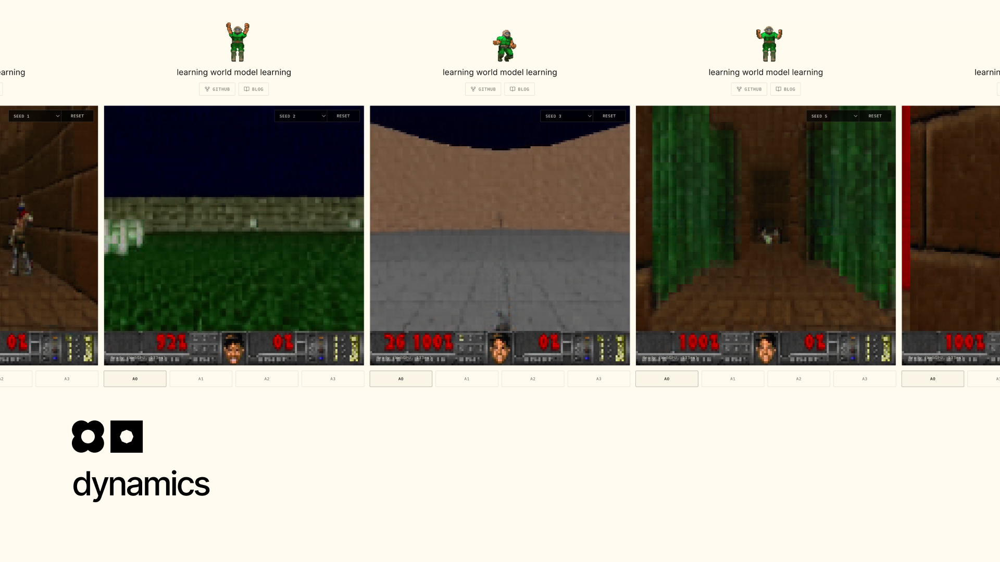
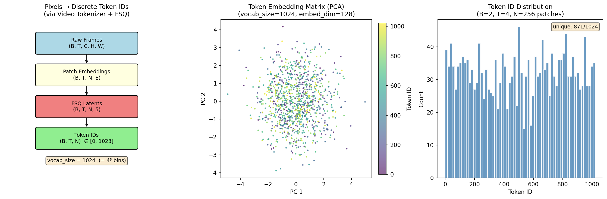
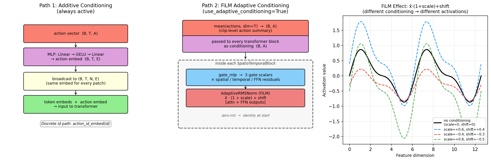
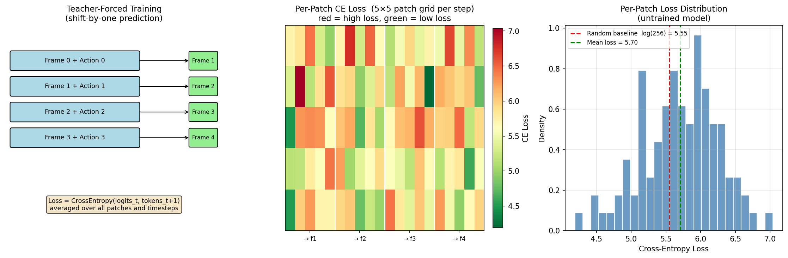
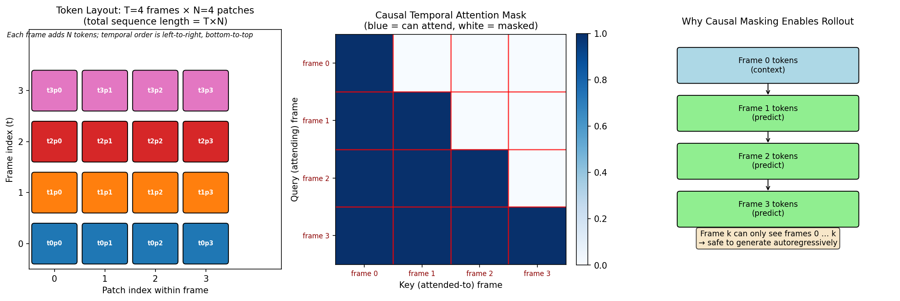
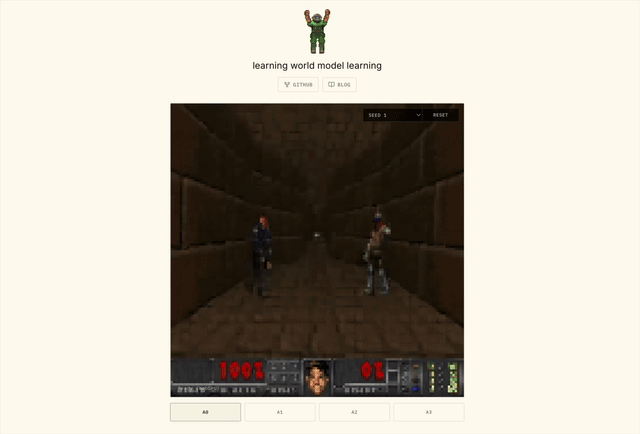

# 3. Dynamics

It's been 2 months since I last wrote an update to Learning World Model Learning. This is quite embarrassing to say but it was just because I was too lazy to write. In hindsight, it's even more embarrassing because the dynamics model is actually the easiest model to implement and to conceptualize. We have actually covered all the critical questions in the previous articles. This includes the core of the dynamics model itself, I'll explain in the next section.

Thanks to my readers for having pressured me into releasing this. It really made me feel like this helps people other than just me.

## What We Have Learned

Before building dynamics, let's briefly walk through the questions we already answered.

### 1. How do we represent the state?

In [article 1](../1.video-tokenizer/README.md), we learned that raw pixels are too expensive and too unstructured for a small world model. A 128x128 RGB frame has `128 * 128 * 3 = 49,152` values. A transformer can technically consume this, but it would spend most of its capacity learning local pixel statistics instead of learning what changed in the scene.

So I compressed frames into discrete visual tokens using the [video tokenizer](../1.video-tokenizer/README.md). A frame becomes a grid of patch tokens.

### 2. Where do we get actions?

In [article 2](../2.inverse-dynamics/README.md), we learned that internet video does not come with action labels. If we want to train on arbitrary video, we cannot assume access to controller inputs, robot joints, or human annotations.

So I used inverse dynamics, which basically translates to getting actions from two video frames: the current video frame and the future video frame. This is an incredibly helpful notion to understand, especially in modern robotics as annotated data is not easy to come across.

I covered how such a model is built, what does the architecture look like, how do we translate continuous vectors to discrete vectors, the impact of loss function and how to avoid model collapse. We understood that action is essentially a delta vector, which the model can use to condense information into. If you tell the model it only has N possible vectors to condense information into, it will categorize all delta between all consecutive frames into these N possible vectors. That's it.

It begs a question though, in essence, to train an inverse dynamics model, we need some way to validate that the action we predict in fact can be used to reconstruct future frames. This is the loss function of the inverse dynamics model itself. So why don't we use that part of the inverse dynamics model as the dynamics model?

### 3. Why not use the inverse dynamics decoder as the world model?

The answer lies in which modality the loss function is leveraged on.

The decoder in [article 2](../2.inverse-dynamics/README.md) exists to train the action encoder. It predicts pixels directly so the inverse dynamics model receives a reconstruction loss. But pixel prediction is wrong and too noisy. We have N number of tokens per image patch, the effect of outputting the wrong token for a patch is much more noticeable than outputting the wrong patch itself. The intuition for this comes if you try to compare the patches of a few different tokens, it's really hard to differentiate.

I want tokens in, tokens out. Not pixels in, pixels out. That's why I have the tokenizer decoder from [article 1](../1.video-tokenizer/README.md), to turn tokens back into frames.

## The Problem

We now have a state representation and an action representation. The missing piece is the transition. How can we convert current tokens and current action into future tokens:

```
f(tokens_t, action_t) = tokens_t+1
```

This is the dynamics model. It is the part that lets an agent choose an action and watch the imagined world respond.

If this model ignores actions, it becomes a passive video predictor. If it only memorizes token sequences, it cannot be controlled. The goal here is to train a model that uses both the current visual state and the latent action to predict the next visual state.


## The Questions

In honesty, I was struggling to think of first principle questions for this article. We have practically answered all of them in the previous writings.

The remaining questions are more practical than of first principles. I'll also cover some questions that are more exploratory towards the topic, not restricting ourselves to the dynamics model itself.

1. **What is the architecture of a dynamics model?**
2. **How do we load data from large datasets?**
3. **How do we train a large model the cheapest?**
4. **When is low loss bad?**
5. **What if we pre-train the inverse dynamics model on annotated videos?**
6. **How do we support continuous actions?**

## The Answers

### 1. What is the architecture of a dynamics model?

At this point we have two pieces: a tokenized representation of what the world looks like (article 1) and a discrete action that summarizes what happened between frames (article 2). The dynamics model is just a transformer that predicts the next set of tokens given the current tokens and the action.

#### Architecture

From [dynamics/models/dynamics_model.py](dynamics/models/dynamics_model.py):

```python
class TokenDynamicsModel(nn.Module):
    def __init__(
        self,
        vocab_size: int = 1024,    # must match the video tokenizer's codebook size
        num_patches: int = 256,
        action_dim: int = 3,       # latent action dimension from inverse dynamics
        n_actions: int = 8,        # must equal 2^action_dim
        embed_dim: int = 128,
        num_heads: int = 8,
        num_blocks: int = 4,
        ...
    ):
        self.token_embed = nn.Embedding(vocab_size, embed_dim)

        # two paths — one for continuous latent vectors (B, T, A), one for discrete ids (B, T)
        # which runs is decided at runtime by the shape of the incoming tensor
        self.action_proj = nn.Sequential(
            nn.Linear(action_dim, embed_dim),
            nn.GELU(),
            nn.Linear(embed_dim, embed_dim),
        )
        self.action_id_embed = nn.Embedding(n_actions, embed_dim)

        self.pos_encoding = SpatioTemporalPositionalEncoding(...)
        # causal_temporal=True prevents the model from attending to future frames,
        # which would make next-frame prediction trivial (causal leakage)
        self.transformer = SpatioTemporalTransformer(..., causal_temporal=True)
        self.output_head = nn.Sequential(
            nn.LayerNorm(embed_dim),
            nn.Linear(embed_dim, vocab_size),
        )
```

The forward pass embeds tokens, adds positional encoding, then broadcasts the action across every patch and adds it before the transformer runs:

```python
def forward(self, video_tokens: torch.Tensor, actions: torch.Tensor) -> torch.Tensor:
    x = self.token_embed(video_tokens.long())       # (B, T, N, E)
    x = self.pos_encoding(x, add_temporal=True)

    # actions are one vector per frame (B, T, E) — broadcast to every patch (B, T, N, E)
    action_embeddings = self._embed_actions(actions)
    action_embeddings = action_embeddings.unsqueeze(2).expand(-1, -1, N, -1)
    x = x + action_embeddings

    # conditioning is an optional deeper action signal — explained in the next section
    x = self.transformer(x, conditioning=conditioning)
    return self.output_head(x)  # (B, T, N, V)
```

The action is added once, before the transformer. Every patch in frame `t` carries a copy of action `t` baked into its representation, and the transformer does the rest, mixing this information across patches and frames with causal temporal attention.



#### Conditioning

If you look at the forward pass carefully, there are actually two separate mechanisms for getting the action signal into the model.

The first is **additive conditioning**, which is always on. The action vector is projected to embedding size and added element-wise to every patch token before the transformer sees anything:

```python
action_embeddings = self._embed_actions(actions)                    # (B, T, E)
action_embeddings = action_embeddings.unsqueeze(2).expand(-1, -1, N, -1)  # (B, T, N, E)
x = x + action_embeddings
```

This is a direct, low-overhead injection. The action is fused with the visual state at the input level.

The second is **adaptive conditioning** (off by default, enabled via `use_adaptive_conditioning=True`). Instead of injecting the action at the input, it passes a summary of the action sequence into every transformer block to condition the layer norms:

```python
def _action_conditioning(self, actions: torch.Tensor) -> Optional[torch.Tensor]:
    if not self.use_adaptive_conditioning:
        return None
    # intentionally coarse: averages over all timesteps to produce one summary per sequence
    # per-frame precision is already handled by additive conditioning
    return actions.float().mean(dim=1)   # (B, A)

x = self.transformer(x, conditioning=conditioning)  # None = no-op; vector = FiLM
```

This is sometimes called FiLM (Feature-wise Linear Modulation): the conditioning vector produces scale and shift parameters that modulate each block's normalized activations. The intuition is that the same token context should be processed differently depending on which action regime the sequence belongs to.

Additive conditioning is per-timestep and fine-grained. Adaptive conditioning is coarse (it averages over all timesteps) but reaches deeper into the network, nudging every layer rather than just the input. In practice the additive path is enough for small models. The adaptive path is worth enabling if you see the model ignoring the action signal.



For more on how the action representation itself is built (why latent codes rather than raw vectors, what FSQ quantization gives you, and how to avoid action-ignore collapse), see [article 2](../2.inverse-dynamics/README.md).

#### Training

Training is teacher-forced: the model always receives ground truth frames as input, never its own predictions. This means training is stable, but the model has never had to recover from its own mistakes. That gap shows up as drift during long rollouts.

```python
def training_step(self, video_tokens, actions):
    input_tokens  = video_tokens[:, :-1].contiguous()   # (B, T-1, N)
    target_tokens = video_tokens[:, 1:].contiguous()    # (B, T-1, N)

    logits = self(input_tokens, actions)                # (B, T-1, N, V)
    loss = F.cross_entropy(
        logits.reshape(-1, self.vocab_size),
        target_tokens.long().reshape(-1),
    )
    return loss, logits
```



#### Inference

At inference there are no ground truth future frames to feed in. Instead we autoregressively roll forward: predict the next frame, append it to the context, then use that as input for the next step.

```python
@torch.no_grad()
def rollout(self, start_tokens, actions, temperature=1.0, sample=False):
    # temperature > 1 = more random, < 1 = sharper; sample=False uses argmax
    generated = [start_tokens.long()]
    used_actions = []

    for step in range(actions.shape[1]):
        used_actions.append(actions[:, step])
        # context grows by one frame each step — the transformer sees the full history,
        # not just the previous frame
        context_tokens  = torch.stack(generated, dim=1)
        context_actions = torch.stack(used_actions, dim=1)
        next_tokens = self.predict_next(context_tokens, context_actions, temperature, sample)
        generated.append(next_tokens)

    return torch.stack(generated, dim=1)  # (B, S+1, N)
```

If the model actually learned to use actions, different action choices from the same `start_tokens` should produce different futures. That controllability is the whole point.

### 2. How do we load data from large datasets?

#### A small note

One thing I hope you’ll get after this is the fact that models are really easy to conceptualize. Especially with agents writing the code these days, the barrier to understanding and writing models is incredibly smaller than before. The model and harness gap from when I started writing this article in January compared to May is really stark.

So what is actually hard? Scaling infrastructure.

One thing you’ll find that separates AI enthusiasts and actual people at the frontier of AI is the ability to work with scale. In fact the question I ask people who presents themselves as AI researchers nowadays is “What’s the largest dataset size you’ve worked with?”

My personal best is 120GB for training a voice model which is not much at all. But even when you start working at that scale, things start to break and get slow really fast if you don’t know how to operate infrastructure and optimize from first principles how your memory is moved and how your dataset is designed and stored.

For example, if you start a training run with videos naively, one bottleneck you’ll hit very early on is decoding speed. You’ll have to figure whether you want to decode your videos first and store them in memory (which will cost a lot of memory) or to decode them on the fly using a codec accelerator (which will obviously be the bottleneck if your training consumes more data than your codec can decode).

If you have worked with large corpus of text data before, here is a good pointer on what the industry standards are: https://github.com/huggingface/datatrove

Now, this repo is not an example on scaling at all. On the contrary, I made things purposefully slow so it’s simpler to digest.

A rule of thumb: never optimize before you know your thing actually works. Wasting time on optimization early on is one of the most frequent traps I see. Most of the time the reason is for saving time, but most of the time fixing broken stuff actually consumes more time than what the optimization gives. This is called a sanity check.

#### How I do data

My `VideoFolderDataset` decodes `.mp4` files using `cv2.VideoCapture` on the CPU. H.264 does not store frames independently: it stores keyframes and then deltas from those keyframes. So seeking to a random position and reading 4 frames means the codec has to find the nearest keyframe, decode every intermediate frame to get there, and only then hand you the frames you actually asked for. All of this is sequential CPU work.

From [1.video-tokenizer/video_tokenizer/data_utils.py](../1.video-tokenizer/video_tokenizer/data_utils.py):

```python
def __getitem__(self, idx: int) -> torch.Tensor:
    video_path, start_frame = self.clips[idx]

    cap = cv2.VideoCapture(str(video_path))
    cap.set(cv2.CAP_PROP_POS_FRAMES, start_frame)  # seek, triggers keyframe decode

    frames = []
    for i in range(self.num_frames):
        ret, frame = cap.read()                         # decode one frame at a time
        frame = cv2.cvtColor(frame, cv2.COLOR_BGR2RGB)  # color conversion
        frame = cv2.resize(frame, (self.frame_size, self.frame_size))
        frame = torch.from_numpy(frame).float() / 255.0
        frames.append(frame.permute(2, 0, 1))

    cap.release()
    return torch.stack(frames, dim=0)
```

If you feed this into a training loop directly and the GPU is fast enough, it will sit idle waiting for the DataLoader workers to finish decoding. Increasing `num_workers` helps up to a point, but you're still burning CPU cycles every epoch on the exact same files.

The fix is to pay the codec cost once. During precompute, I run `VideoFolderDataset` through both frozen models, convert everything to token and action tensors, and save those to disk. From that point on, the training loop never touches a video file again.

Running the frozen tokenizer and inverse dynamics model on every training batch would add another problem on top of codec cost. You'd be paying the full cost of two pretrained transformers on every step just to get inputs. So I don't. I precompute everything once, save it to disk, and train purely from the cache.

From [dynamics/data_utils.py](dynamics/data_utils.py):

```python
class TokenDynamicsDataset(Dataset):
    def __init__(self, ...):
        self.metadata = self._build_metadata()
        cache = None if refresh_cache else self._load_cache_if_valid()
        if cache is None:
            cache = self._precompute_and_cache()

        self.tokens  = cache["tokens"].long()   # (S, T, N)
        self.actions = cache["actions"].float() # (S, T-1, A)
```

The precompute pass runs both frozen models over every video clip and concatenates the results:

```python
def _precompute_and_cache(self) -> dict:
    tokenizer     = self._load_video_tokenizer()
    inverse_model = self._load_inverse_dynamics_model()

    with torch.no_grad():
        for batch_idx, frames in enumerate(video_loader):
            frames = frames.to(self.precompute_device)

            _, tokens, _ = tokenizer.encoder(frames)    # (B, T, N)
            actions = inverse_model.encode(frames)       # (B, T-1, A)

            token_batches.append(tokens.cpu())
            action_batches.append(actions.cpu())

    tokens  = torch.cat(token_batches,  dim=0).long()
    actions = torch.cat(action_batches, dim=0).float()

    payload = {"metadata": self.metadata, "tokens": tokens, "actions": actions}
    torch.save(payload, tmp_path)
    tmp_path.replace(self.cache_path)
```

After this runs once, every subsequent training run skips straight to loading the `.pt` file. For 100 videos at 4 frames per clip, this is the difference between waiting 10 minutes per epoch and waiting 10 seconds.

The cache is keyed on clip geometry so it automatically invalidates if you change anything that would affect the precomputed values:

```python
def _cache_filename(self) -> str:
    return (
        "token_dynamics_"
        f"T{self.num_frames}_H{self.frame_size}_N{self.num_patches}_"
        f"A{self.action_dim}_skip{self.frame_skip}.pt"
    )
```

But the filename only covers geometry. If you retrain the tokenizer or inverse model and swap in a new checkpoint, the filename stays the same. That's why the cache also stores metadata that includes the checkpoint mtimes:

```python
def _build_metadata(self) -> dict:
    return {
        "num_frames": self.num_frames,
        "frame_size": self.frame_size,
        ...
        "video_latest_mtime": max(path.stat().st_mtime for path in video_paths),
        "tokenizer_checkpoint_mtime": self._path_mtime(self.tokenizer_checkpoint),
        "inverse_dynamics_checkpoint_mtime": self._path_mtime(
            self.inverse_dynamics_checkpoint
        ),
    }
```

On load, it compares stored metadata against current metadata. Mismatch means stale cache, so it reruns precompute:

```python
def _load_cache_if_valid(self) -> Optional[dict]:
    payload = torch.load(self.cache_path, map_location="cpu", weights_only=False)
    if payload.get("metadata") != self.metadata:
        print(f"Ignoring stale token/action cache: {self.cache_path}")
        return None
    return payload
```

Before you have real video data, there's also a dummy dataset that generates random token/action tensors with the right shapes, useful for checking that the model, loss, and training loop agree on dimensions before committing to a full precompute:

```python
class DummyTokenDynamicsDataset(Dataset):
    def __getitem__(self, idx: int) -> dict:
        tokens  = torch.randint(0, self.vocab_size, size=(self.num_frames, self.num_patches))
        actions = torch.randint(0, 2, size=(self.num_frames - 1, self.action_dim)).float()
        actions = actions * 2 - 1
        return {"tokens": tokens, "actions": actions}
```

Pass `--use-dummy-data` to `train.py` and it uses this instead of hitting disk at all.

### 3. How do we train a large model the cheapest?

There are a lot of practical questions to answer when it comes to training a large model. One of them is the cost. You can't just rent a GPU server and hold it indefinitely until your training completes. The cost would skyrocket.

So the fastest way to cut costs is using spot instances. These are preemptible VMs that GCP, AWS, and Azure rent at 60-80% discount because they can reclaim them at any moment. Literally meaning your job can be canceled at any time if these instances are reclaimed.

To survive this, you need a way for your training to survive across restarts (just imagine power outages for simplicity). In first principles, you need your training job to restart automatically and you need your models' checkpoints to be saved somewhere so the training job can start where it left off.

For this, I use [SkyPilot](https://skypilot.readthedocs.io).

#### Managed jobs

[SkyPilot](https://skypilot.readthedocs.io) managed jobs (`sky jobs launch`) handle the restart side. SkyPilot provisions a controller VM that watches your job. When a spot preemption happens, the controller notices the VM disappeared, provisions a new one across clouds, regions, or GPU types if needed, and re-runs your script from scratch on the new machine.

```bash
sky jobs launch 3.dynamics/skypilot/train.yaml -n lwm-train
```

Note: There are many way to spawn a SkyPilot job. The key difference of `sky jobs launch` from `sky launch` is that managed jobs own the full lifecycle: provisioning, recovery, and teardown. You submit once and forget it. SkyPilot will spawn a cheap persistent VM for orchestrating jobs on the cloud of your choice.

#### Persistent checkpoints

"Re-runs your script from scratch" only helps if the script can skip work it already did. That requires two things: checkpoints that outlive the VM, and logic in the run script to detect and resume them.

The VM's local disk disappears on eviction. I mount a GCS bucket at the checkpoint directories instead:

```yaml
file_mounts:
  ~/persistent/checkpoints:
    name: lwm-world-model-binhpham
    store: GCS
    mode: MOUNT
```

With `mode: MOUNT`, GCS is mounted via gcsfuse. Every `torch.save(checkpoint, path)` writes directly to the bucket. The VM can die immediately after and the file is safe.

At the start of each stage, the run script checks whether that stage already completed by looking for `final_model.pt`, and resumes from the latest epoch checkpoint if training was still in progress:

```bash
latest_ckpt() { ls -t "$1"/checkpoint_epoch*.pt 2>/dev/null | head -1; }

if [ -f "$TOK_CKPT_DIR/final_model.pt" ]; then
  echo "Stage 1 already complete, skipping"
else
  RESUME=$(latest_ckpt "$TOK_CKPT_DIR")
  RESUME_ARGS=(); [ -n "$RESUME" ] && RESUME_ARGS=(--resume "$RESUME")
  uv run python 1.video-tokenizer/train.py ... "${RESUME_ARGS[@]}"
fi
```

If the tokenizer was at epoch 18/25 when preempted, the next run finds `checkpoint_epoch18.pt` in GCS, resumes from epoch 19, and finishes without restarting from scratch. If stage 1 is already done, it gets skipped and training moves straight to stage 2.

#### Data caching

Training data has the same problem. Generating 100 Doom videos takes around 20 minutes. I don't want to pay that on every recovery.

I store data in GCS too, but I don't train directly from the GCS mount. Reading video frames through gcsfuse on every batch is about 2x slower than local SSD. So at startup the run script copies data from the GCS cache to local disk instead:

```bash
if [ -n "$(ls -A "$DATA_CACHE"/*.mp4 2>/dev/null)" ]; then
  echo "Copying data from GCS cache to local disk"
  cp "$DATA_CACHE"/*.mp4 "$DATA_PATH/"
else
  # First run: generate and upload to cache
  python3 generate_doom.py --output-dir "$DATA_PATH" ...
  cp "$DATA_PATH"/*.mp4 "$DATA_CACHE/"
fi
```

First run: about 20 min to generate, 2 min to upload. Every subsequent run including preemption recoveries: 2 min to copy from GCS. Training reads from local SSD at full speed.

Disclaimer: This works because my dataset is small. At larger scales the copy step itself becomes the bottleneck: waiting hours to transfer data before training can even start is not acceptable. The fix is sharding and lazy loading: instead of many small files, you pack samples into large sequential archives (usually 100-500MB each) and pull them in at training time. Object storage like GCS has high per-request latency: every file you open costs a network round trip with its own overhead. With thousands of small files that latency dominates and throughput tanks. With large shards you have far fewer requests, so instead of being latency-bound you become throughput-bound. GCS throughput is not as fast as local disk, but it is good enough to keep the GPU fed when you prefetch the next shard while consuming the current one. Libraries like [WebDataset](https://github.com/webdataset/webdataset) and [MosaicML Streaming](https://github.com/mosaicml/streaming) are built around this pattern and let you stream shards directly from GCS without copying anything locally first.

#### In practice

The full pipeline (3 stages, 100 videos, about 5h on A100) cost roughly $3-5 on GCP spot. On-demand would be $15-20 for the same compute. Preemption recovery overhead is usually under 5 minutes per event, mostly re-mounting GCS and copying data. Since I ran this training without any preemptions, the total wall-clock time was close to the theoretical minimum.

The `3.dynamics/skypilot/train.yaml` in this repo has all of this wired up. To run the full pipeline:

```bash
sky jobs launch 3.dynamics/skypilot/train.yaml -n lwm-train
sky jobs logs lwm-train  # stream output
```

After completion, pull checkpoints from GCS:

```bash
gsutil cp -r gs://lwm-world-model-binhpham/checkpoints/ ./checkpoints/
```

Another point I would like to say is utilization really matters here. If you manage to rent a H100 for 1$/hour but only use 50% of it at all time, you'll waste 0.5$/hour. Pick the compute that suits you so you can optimize your cost. In addition, there can be more optimization when it comes to using multiple GPUs at once, but that's out of scope of this article for now, it's an entire rabbit hole on its own.

### 4. When is low loss bad?

Low loss is good, but that's only if your model doesn't abuse the loss function. Collapse is when the model finds a shortcut to low loss that doesn't require learning real dynamics. In our specific case, there are a few collapse scenarios to pay attention to.

The simplest one is copy collapse: the model just predicts `tokens_t+1 = tokens_t`. Most consecutive frames share the majority of their tokens: backgrounds don't move, objects move slowly. A model that copies gets a surprisingly low cross-entropy for free, but it can't generate motion and doesn't care about the action at all.

Similar is frequency collapse: instead of copying the previous frame, the model learns to predict whatever token appears most often at each spatial position. Some datasets have huge flat regions: floors, walls, ceilings. A model can do well on average accuracy while always guessing these dominant tokens, ignoring both the frame and the action.

The scariest one is action-ignoring collapse. The model learns genuine visual dynamics, predicts plausible next frames from token context, but does this without touching the action conditioning at all. The loss looks fine. The reconstructions look fine. But give it the same starting frame with two different actions, and it produces the same future both times. You can only catch this during validation by sweeping actions and checking whether futures diverge. Notice that the current validate.py only checks cross-entropy loss:

From [validate.py](validate.py):

```python
def validate(model, dataloader, device) -> float:
    model.eval()
    with torch.no_grad():
        for batch in dataloader:
            tokens  = batch["tokens"].to(device)
            actions = batch["actions"].to(device)
            loss, _ = model.training_step(tokens, actions)
```

This tells you nothing about whether different actions produce different futures. You'd need to add a rollout sweep: fix a starting frame, run `rollout()` with every possible action id, and measure the variance across the resulting token sequences.

There is also a subtler failure that lives one stage earlier in the video tokenizer: codebook collapse. The tokenizer maps every patch to one of 512 discrete tokens, but nothing forces it to use all of them. If the dataset is visually repetitive, think the same wall textures and floor tiles, the model can achieve low reconstruction loss while only using a small fraction of the vocabulary. The dynamics model then trains on that sparse token distribution, which makes its prediction problem easy and limits how much the world model can actually express. The fix is entropy regularization on the tokenizer. You add a term to the training loss that penalizes concentrated codebook usage and pushes the model toward a more uniform distribution over codes within each batch.

From [1.video-tokenizer/video_tokenizer/models/video_tokenizer.py](../1.video-tokenizer/video_tokenizer/models/video_tokenizer.py):

```python
def _codebook_entropy_loss(self, z: torch.Tensor) -> torch.Tensor:
    num_bins = self.encoder.num_bins

    z_flat = z.reshape(-1, z.shape[-1])
    z_bounded = torch.tanh(z_flat)
    z_scaled = (z_bounded + 1) / 2 * (num_bins - 1)

    # Soft assignment: distance to each bin center
    bin_centers = torch.arange(num_bins, device=z.device, dtype=z.dtype)
    distances = (z_scaled.unsqueeze(-1) - bin_centers) ** 2
    probs = F.softmax(-distances / 0.1, dim=-1)

    # Average over batch to get marginal per-dimension distribution
    avg_probs = probs.mean(dim=0)

    # Normalized per-dimension entropy, negated so minimizing it maximizes entropy
    entropy = -(avg_probs * torch.log(avg_probs + 1e-10)).sum(dim=-1)
    return -entropy.mean() / math.log(num_bins)
```

The key idea is that instead of looking at hard token counts (which have no gradient), we compute a soft probability over bin centers for each latent dimension. We then average that distribution across the batch and measure its entropy. When the model collapses to a few codes, this entropy is low and the loss goes up. When codes are spread evenly, entropy is maximized and the term contributes nothing.

The last one is more of a code bug than a training failure: causal leakage. If the temporal attention mask isn't strictly upper triangular, patches at frame `t` can attend to frames `t+1` or later. The model trivially predicts the future by looking at it, loss drops to near-zero immediately, and you think you've built a great model. The fix is always enforcing `causal_temporal=True` in the transformer constructor:

From [dynamics/models/dynamics_model.py](dynamics/models/dynamics_model.py):

```python
self.transformer = SpatioTemporalTransformer(
    embed_dim=embed_dim,
    num_heads=num_heads,
    num_blocks=num_blocks,
    dropout=dropout,
    causal_temporal=True,   # <-- this must be True
    conditioning_dim=conditioning_dim,
)
```



### 5. What if we pre-train the inverse dynamics model on annotated videos?

The inverse dynamics model we built discovers actions purely from reconstruction loss. The actions it finds work, but they're anonymous. Action 3 might be "strafe left," but nothing forced it to be. If you have even a small set of annotated clips, say Doom recordings with controller inputs logged, you can pre-train the encoder supervised before switching to the unsupervised reconstruction objective.

In the pre-training phase, instead of `inverse_model.encode(frames)` producing unlabeled latent codes, you train the encoder directly against known controller states. The encoder learns that certain frame deltas map to "move forward," others to "turn right." You're giving it a semantic skeleton.

Then you switch to the standard unsupervised pipeline on the large unlabeled dataset:

From [dynamics/data_utils.py](dynamics/data_utils.py):

```python
with torch.no_grad():
    for batch_idx, frames in enumerate(video_loader):
        frames = frames.to(self.precompute_device)

        _, tokens, _ = tokenizer.encoder(frames)           # (B, T, N)
        actions = inverse_model.encode(frames)             # (B, T-1, A)

        token_batches.append(tokens.cpu())
        action_batches.append(actions.cpu())
```

Now `inverse_model.encode` is producing latent codes that already have semantic structure from pre-training, not random cluster ids. The dynamics model inherits this: when you condition on action 3, you have a reasonable expectation of what it means.

The limitation is domain transfer. If your annotated clips are close to your unlabeled footage, the pre-trained semantics survive fine-tuning. If they're not, the fine-tuning on unlabeled data will drift the encoder away from the annotated semantics anyway. Semi-supervised only helps if the two datasets share enough structure.

This is exactly what OpenAI did with [VPT (Video Pre-Training)](https://github.com/openai/Video-Pre-Training). They hired contractors to play Minecraft while logging controller inputs, trained an inverse dynamics model on that small annotated set, then used it to pseudo-label 70,000 hours of unlabeled Minecraft footage from the internet. The resulting action labels were good enough to train a behavioral cloning policy that learned to craft diamond tools, a task that requires hundreds of sequential steps and had never been solved from video alone. The key insight is that you don't need annotations at scale; you only need enough to anchor the inverse dynamics model's latent space to something semantically meaningful.

### 6. How do we support continuous actions?

The dynamics model supports two action modes out of the box. The `_embed_actions` method checks the shape of the incoming tensor to decide which path to take:

From [dynamics/models/dynamics_model.py](dynamics/models/dynamics_model.py):

```python
def _embed_actions(self, actions: torch.Tensor) -> torch.Tensor:
    if actions.dim() == 2:
        # Discrete action id path: (B, T) -> (B, T, E)
        return self.action_id_embed(actions.long())

    if actions.dim() == 3:
        # Continuous latent vector path: (B, T, A) -> (B, T, E)
        return self.action_proj(actions.float())
```

Both `action_id_embed` and `action_proj` are initialized in `__init__`, so the model is always ready for either:

```python
self.action_proj = nn.Sequential(
    nn.Linear(action_dim, embed_dim),
    nn.GELU(),
    nn.Linear(embed_dim, embed_dim),
)
self.action_id_embed = nn.Embedding(n_actions, embed_dim)
```

To use continuous actions, skip the FSQ quantization step in the inverse dynamics model and pass the raw latent vectors directly. The dynamics model accepts them as-is through `action_proj`. To use discrete actions, pass the integer code ids and the model routes them through `action_id_embed` instead.

The tradeoff is planning. With `n_actions = 8` discrete codes, you can run 8 rollouts in parallel and compare them, exhaustive search over the action space in one forward pass. With continuous actions, the space is infinite. You'd need gradient-based search or random sampling to explore it, which is slower and less principled.

There's also a regularization argument for discrete. The FSQ bottleneck forces the inverse dynamics encoder to compress the frame delta into one of N categories, which strips out lighting noise, compression artifacts, and other things that look like motion but aren't. Continuous actions carry all of that along for free.

The cost of discrete is information loss. With 8 buckets, fine-grained movements that are close in behavior collapse into the same code. Continuous actions avoid this entirely, which matters if you specifically need smooth interpolation between actions in latent space, e.g. for a learned planner that optimizes through the action space with gradients.

## Live Demo

Now, I know many of you guys won't even bother to run the experiments in this repo. So I created a live demo here for you to try.



## Dimensions Reference

| Symbol | Meaning                     | Default |
| ------ | --------------------------- | ------- |
| B      | Batch size                  | 8       |
| T      | Number of frames in a clip  | 4       |
| H, W   | Frame height/width          | 128     |
| P      | Patch size                  | 8       |
| N      | Patches per frame = (H/P)^2 | 256     |
| E      | Embedding dimension         | 128     |
| V      | Token vocabulary size       | 1024    |
| A      | Latent action dimension     | 3       |

## Usage

Run all commands from the **project root**.

Run the test job first. CPU-only, under a minute. Trains a tiny version of all 3 models with dummy data and runs a rollout through the full pipeline with shape assertions:

```bash
sky launch 3.dynamics/skypilot/test.yaml
```

Point `DATA_PATH` in `train.yaml` at wherever you put the videos, then launch training. Trains all 3 models in sequence on a spot L4, passing checkpoints from each stage into the next:

```bash
sky jobs launch 3.dynamics/skypilot/train.yaml -n lwm-train
sky jobs logs lwm-train
```

Validate. Loads `best_model.pt` and reports cross-entropy loss on a held-out split:

```bash
sky launch 3.dynamics/skypilot/validate.yaml
```

Pull checkpoints from GCS after training completes:

```bash
gsutil cp -r gs://lwm-world-model-binhpham/checkpoints/ ./checkpoints/
```

## Files

```
3.dynamics/
├── README.md
├── config.py
├── train.py
├── validate.py
├── pyproject.toml
├── checkpoints/
├── data/
│   └── generate_doom.py
├── skypilot/
│   ├── train.yaml
│   ├── validate.yaml
│   └── test.yaml
└── dynamics/
    ├── __init__.py
    ├── data_utils.py
    └── models/
        ├── __init__.py
        └── dynamics_model.py
```

## Run Log

### The dataset

Article 2 used real Doom footage from the [Doom Gameplay Dataset](https://github.com/thavlik/doom-gameplay-dataset). That dataset is gone: the author deleted the bucket. So I generate my own with [VizDoom](https://vizdoom.cs.put.edu.pl). VizDoom is a Python wrapper around Doom's engine. You write a bot, it plays the game, you record both the screen and the exact buttons pressed. You get ground-truth action labels for free.

It's also self-contained. The open-source `freedoom2.wad` is bundled with the vizdoom package, no external downloads. The generation script installs in a single `pip install vizdoom` and produces `N` videos in one pass.

#### How I generate

The script is at [`2.inverse-dynamics/data/generate_doom.py`](../2.inverse-dynamics/data/generate_doom.py). It runs 4 bot personalities across 6 Doom scenarios:

| Personality | Behavior                                                    |
| ----------- | ----------------------------------------------------------- |
| Explorer    | Moves forward continuously, turns occasionally              |
| Fighter     | Cycles between strafing, shooting, and turning aggressively |
| Wanderer    | Picks a random action combo and holds it for 1-2 seconds    |
| Rusher      | Alternates between sprinting forward and snapping turns     |

| Scenario          | Character                                 |
| ----------------- | ----------------------------------------- |
| deadly_corridor   | Linear corridor with enemies              |
| my_way_home       | Maze navigation                           |
| defend_the_center | Arena, enemies spawn and rush in          |
| health_gathering  | Open map, collect health packs to survive |
| defend_the_line   | Fixed position, enemies approach in waves |
| deathmatch        | Open map, free-roam combat                |

For each video, I randomly sample one scenario and one personality. 100 videos at 60 seconds each at 15fps gives 90,000 frames, or about 22,500 training clips at 4 frames per clip.

#### Dataset samples

Five samples from the generated dataset (10s each):

| Sample 1                                                                          | Sample 2                                                                          | Sample 3                                                                          |
| --------------------------------------------------------------------------------- | --------------------------------------------------------------------------------- | --------------------------------------------------------------------------------- |
| <video src="../assets/doom-samples/doom_1_trim.mp4" width="240" controls></video> | <video src="../assets/doom-samples/doom_2_trim.mp4" width="240" controls></video> | <video src="../assets/doom-samples/doom_3_trim.mp4" width="240" controls></video> |

| Sample 4                                                                          | Sample 5                                                                          |
| --------------------------------------------------------------------------------- | --------------------------------------------------------------------------------- |
| <video src="../assets/doom-samples/doom_4_trim.mp4" width="240" controls></video> | <video src="../assets/doom-samples/doom_5_trim.mp4" width="240" controls></video> |

#### What I observed

To be honest, the model performance after training is not that good. I only trained on 100 videos and there were no action labels, so the model didn't land on the expected actions. I'm not sure if it should at larger scale as well, considering that most unlabled world model training formulas at big labs right now are VPT-like.

In the first few runs, I had to go through a few collapse scenarios, for example, codebook collapse. At first, I used a codebook size of 1024, but the model only used ~100. This is rather damaging to the dynamics model later on as it has to learn there are plenty of useless tokens to avoid. So I went back and drop the codebook size to 512 and add more invariance penalty. This pushed to 100% codebook utilization and improved the dynamics model drastically. I'm also quite sure I can make the model more robust against action collapse. But my compute is limited. I only reserved 100$ for the entirety of this article.

If you would like to see more, I'm not shy from receiving compute grants. Reach out to me at binhpham@binhph.am

## What's Next?

## References

- **Genie** - Bruce et al., "Genie: Generative Interactive Environments", Google DeepMind, 2024. [arXiv:2402.15391](https://arxiv.org/abs/2402.15391)
- **MaskGIT** - Chang et al., "MaskGIT: Masked Generative Image Transformer", CVPR 2022. [arXiv:2202.04200](https://arxiv.org/abs/2202.04200)
- **FSQ** - Mentzer et al., "Finite Scalar Quantization: VQ-VAE Made Simple", ICLR 2024. [arXiv:2310.05737](https://arxiv.org/abs/2310.05737)
- **TinyWorlds** - A compact Genie-style world model implementation by AlmondGod. [GitHub](https://github.com/AlmondGod/tinyworlds)
- **VPT** - Baker et al., "Video PreTraining (VPT): Learning to Act by Watching Unlabeled Online Videos", NeurIPS 2022. [arXiv:2206.11795](https://arxiv.org/abs/2206.11795) · [GitHub](https://github.com/openai/Video-Pre-Training)
