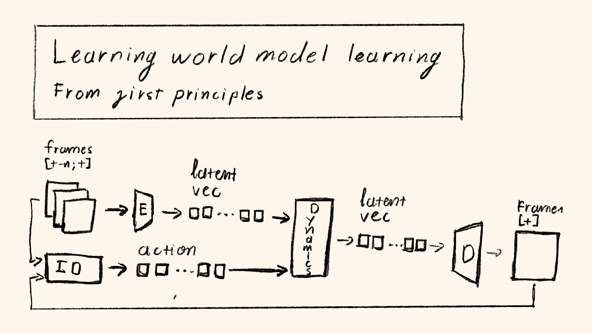

# Learning World Model Learning



Note: This is still a work in progress repo. The first part on video tokenizer is in its draft and testing phase.

GPT-2 from OpenAI was trained on 40GB or 10 billion tokens of data. This was the accumulation of over 8 million web pages from the internet. Let's assume for the same amount of data, we can train a comparable model for general robotics, here's how much it would cost us:

- Total amount of tokens: 10 Billion.
- Tokens per hour of data collection (assumption based on current tokenization methods): `500,000` tokens/hour.
- Total hours: `10,000,000,000 / 500,000 = 20,000` hours = `2,500` days (assuming 8 hours/day) ~= 10 years (with 260 working days/year)
- Cost per hour (minimum wage in US): $7.25/hour + Misc Cost = $20/hour
- Total cost: ~$400,000 ~= 0.5 million dollars

We used several generous assumptions here, especially for the equivalence of tokens between text and modalities such as video and most importantly a similar scaling law between robotics and LLM. It's also notable that most LLM models nowadays are trained on much larger datasets such as FineWeb (~15 Trillion Tokens) and of much higher diversity.

To scale real world data collection to such point would require enormous efforts and capital in the rang of billions. Collecting diverse data in the real world is not simply deploying your robot everywhere. It also requires building the infrastructure necessary for such task: network infrastructure, equipment infrastructure.

```
┌─────────────────────────────────────────────────────────────────────────┐
│                     The Robotics Data Gap                               │
├─────────────────────────────────────────────────────────────────────────┤
│                                                                         │
│   LLM Training Data          vs          Robotics Training Data         │
│   ──────────────────                     ──────────────────────         │
│                                                                         │
│   ┌───────────────┐                      ┌───────────────┐              │
│   │  Internet     │                      │  Teleoperation│              │
│   │  Text Data    │                      │  Data         │              │
│   │               │                      │               │              │
│   │  ~15T tokens  │                      │  ~100K hours  │              │
│   │  (FineWeb)    │                      │  (industry)   │              │
│   │               │                      │               │              │
│   │  Cost: ~$0    │                      │  Cost: ~$2M+  │              │
│   │  (scraped)    │                      │  (human labor)│              │
│   └───────────────┘                      └───────────────┘              │
│                                                                         │
│   Gap: 1000x+ in data, 10000x+ in cost per token                        │
│                                                                         │
└─────────────────────────────────────────────────────────────────────────┘
```

There are multiple methods teams are exploring to close this data gap:

| Approach | Description | Examples |
|----------|-------------|----------|
| **Realistic Simulation** | Physics engines, 3D Gaussian splatting, neural rendering | Isaac Sim, MuJoCo |
| **Low-cost Data Collection** | Reduce equipment costs for human demonstrations | UMI [1], GELLO [2], AirExo [3] |
| **World Models** | Learn environment dynamics from videos, generate synthetic experience | Genie [4], Cosmos [5], V-JEPA [6] |

In this GitHub repo, I document my exploration into world models, which to me is the most viable method of data scaling in robotics. I'll go through my intuition and first principles on why world models even matter and how to build one from scratch using papers.

# Why World Models?

A world model is a prediction model: given the current state of the world and a set of actions, the model can predict what is the next state.

```
                         World Model
                    ┌─────────────────┐
   Current State    │                 │    Next State
   ─────────────────▶   f(s, a) = s'  ├─────────────────▶
                    │                 │
   Action ──────────▶                 │
                    └─────────────────┘
```

In the context of learning, this is how we reason and logic in the real world. For a task such as "lifting a cup of water", we reason that if we hold the cup and move our hand upward, the cup would move, therefore accomplishing our goal. Physics is the model and our mind is the policy trained in such model.

> "A hallmark of intelligence is the ability to use an internal model of the world to plan a sequence of actions to achieve a goal."
> — Yann LeCun, A Path Towards Autonomous Machine Intelligence [7]

Instead of relying on teleoperation data and imitation learning, what if we just let an agent figure the world out by itself? Instead of paying thousands of people to do teleoperation, we can train a world model and let the robot learn in there at a much faster pace than the real world.

```
┌────────────────────────────────────────────────────────────────────────────┐
│                Traditional Imitation Learning vs World Model Learning      │
├────────────────────────────────────────────────────────────────────────────┤
│                                                                            │
│   Traditional Pipeline:                                                    │
│   ┌──────────┐    ┌──────────┐    ┌──────────┐    ┌──────────┐            │
│   │  Human   │───▶│Teleoperate│───▶│  Collect │───▶│  Train   │            │
│   │  Expert  │    │  Robot   │    │  Data    │    │  Policy  │            │
│   └──────────┘    └──────────┘    └──────────┘    └──────────┘            │
│        │                                                                   │
│        ▼                                                                   │
│   Bottleneck: Human time, robot availability, environment diversity       │
│                                                                            │
│   ─────────────────────────────────────────────────────────────────────   │
│                                                                            │
│   World Model Pipeline:                                                    │
│   ┌──────────┐    ┌──────────┐    ┌──────────┐    ┌──────────┐            │
│   │ Internet │───▶│  Train   │───▶│ Generate │───▶│  Train   │            │
│   │  Videos  │    │  World   │    │ Synthetic│    │  Policy  │            │
│   │ (YouTube)│    │  Model   │    │Experience│    │          │            │
│   └──────────┘    └──────────┘    └──────────┘    └──────────┘            │
│        │                               │                                   │
│        ▼                               ▼                                   │
│   Abundant, diverse, free       Infinite, fast, cheap                     │
│                                                                            │
└────────────────────────────────────────────────────────────────────────────┘
```

This would allow us to collect data at scale at a fraction of the cost, since we can leverage real world data such as YouTube videos to learn the dynamics of the real world.

Naturally, to train a world model like this, we would need states of the real world and the action that is being done between frames. Several questions arise: how do we even get the action from raw video frames, how do we even convert such actions to the target embodiment of robots, would a human video be converted to robot video, etc?

Such questions will be slowly answered through this GitHub repo.

> **Note**: There are multiple kinds of world models, depending on how the agent perceives the world and what world the agent is in. For example, a game can be a world model to the player inside it (Dreamer [8] learns to play Minecraft entirely in imagination). A physics simulation based on Newton's law is also a world model for objects that obey such law. In this repository, I strictly focus on **video world models**.

# What Do We Need for a Video World Model?

Again, a world model is a prediction model: given the current state and action, it gives the next state. In the context of a video world model, we are given the current video frame and action and must predict the next video frame.

```
┌────────────────────────────────────────────────────────────────────────────┐
│                    Video World Model Architecture                          │
├────────────────────────────────────────────────────────────────────────────┤
│                                                                            │
│   Frame t                                       Frame t+1                  │
│   ┌─────────┐                                  ┌─────────┐                 │
│   │         │                                  │         │                 │
│   │ 256x256 │                                  │ 256x256 │                 │
│   └────┬────┘                                  └────▲────┘                 │
│        │                                            │                      │
│        ▼                                            │                      │
│   ┌─────────┐                                  ┌────┴────┐                 │
│   │ Video   │                                  │ Video   │                 │
│   │ Encoder │ ─────────── Q1 ───────────────── │ Decoder │                 │
│   └────┬────┘                                  └────▲────┘                 │
│        │                                            │                      │
│        ▼                                            │                      │
│   ┌─────────┐        ┌─────────┐              ┌────┴────┐                  │
│   │ Latent  │───────▶│ Dynamics├─────────────▶│ Latent  │                  │
│   │   z_t   │        │  Model  │              │  z_t+1  │                  │
│   └─────────┘        └────▲────┘              └─────────┘                  │
│                           │                                                │
│                     Q4    │                                                │
│                           │                                                │
│                      ┌────┴────┐                                           │
│                      │ Action  │                                           │
│                      │   a_t   │──── Q2, Q3                                │
│                      └─────────┘                                           │
│                                                                            │
└────────────────────────────────────────────────────────────────────────────┘
```

Out of first principles, there are a few questions we have to answer:

| Question | Challenge | Common Solutions |
|----------|-----------|------------------|
| **Q1: How do we represent the video frame?** | Raw pixels (`256x256x3` = 196K dims) are too high-dimensional | VAE, VQ-VAE, FSQ tokenizers |
| **Q2: How do we represent the action?** | Actions vary across embodiments and tasks | Discrete tokens, continuous vectors, latent actions |
| **Q3: Where do we get the action?** | Internet videos have no action labels | Inverse dynamics models, controller overlay extraction |
| **Q4: How do we predict the next state?** | Must learn complex dynamics and interactions | Transformer, MaskGIT, diffusion models |

These are the core questions of all world model training. In fact, you can understand any world model by just answering these four questions.

## Q1: Representing Video Frames

For videos, we can just give an MLP a large pixel array. But this has proven to be inefficient and outright makes training at scale impossible. For first principle intuition, when you recall a memory, you don't recall the scene down to each receptor in your eye, you recall the characteristics of such scene.

To do this, we need to train a **video encoder** which turns raw video frames into a vector of characteristics. We can do this with a VAE (Variational Autoencoder) or its discrete variants like VQ-VAE and FSQ.

```
   Raw Frame                    Latent Space                    Reconstructed
   (196,608 dims)               (e.g., 256 dims)                (196,608 dims)

   ┌─────────────┐             ┌─────────────┐                 ┌─────────────┐
   │ ░░▓▓████░░  │   Encode    │             │    Decode       │ ░░▓▓████░░  │
   │ ░▓████▓▓░░  │ ──────────▶ │  [z1...zn]  │ ──────────────▶ │ ░▓████▓▓░░  │
   │ ▓████░░░░░  │   (1000x    │             │   (expand)      │ ▓████░░░░░  │
   │ ████░░░░░░  │  compress)  │             │                 │ ████░░░░░░  │
   └─────────────┘             └─────────────┘                 └─────────────┘
```

## Q2 & Q3: Representing and Obtaining Actions

Since most videos on the internet don't have action labels, what we can do is train a model that takes the current frame and next frame and outputs the action. This is called an **Inverse Dynamics Model (IDM)**. The action can be represented either as a discrete vector or a continuous vector.

```
   Frame t              Frame t+1            Inverse Dynamics Model
   ┌─────────┐         ┌─────────┐          ┌─────────────────────┐
   │         │         │         │          │                     │
   │         │ ───────▶│         │ ───────▶ │  What action caused │ ───▶ Action a
   │         │         │         │          │  this transition?   │
   └─────────┘         └─────────┘          └─────────────────────┘
```

To combine both of them, we train another model that takes the current frame, current action and gives the next frame. This is how **Genie** [4] works and will be primarily how I discover world models in this repository.

## Q4: Predicting the Next State

Given the latent representation of the current frame `z_t` and action `a_t`, how do we predict the next latent state `z_{t+1}`? This is the core of the world model - the dynamics function `f(z, a) = z'`.

```
   Latent z_t          Action a_t           Dynamics Model
   ┌─────────┐         ┌─────────┐          ┌─────────────────────┐
   │         │         │         │          │                     │
   │ [z1..n] │ ───────▶│ [a1..k] │ ───────▶ │  f(z_t, a_t) = ?    │ ───▶ Latent z_t+1
   │         │         │         │          │                     │
   └─────────┘         └─────────┘          └─────────────────────┘
```

The dynamics model must learn to:
- Understand how actions affect objects (pushing moves things)
- Predict physical interactions (gravity, collisions)
- Handle occlusions and reappearances
- Generate consistent predictions over multiple steps

Common architectures include **Transformers** (predict next tokens autoregressively), **MaskGIT** (parallel masked prediction), and **Diffusion models** (iterative denoising). This will be explored in detail in `3.dynamics-model`.

## Landscape of World Model Approaches

But there are multiple different ways to answer these questions:

```
┌────────────────────────────────────────────────────────────────────────────┐
│                    World Model Design Space                                │
├────────────────────────────────────────────────────────────────────────────┤
│                                                                            │
│   Frame Representation        Action Source           Prediction Space     │
│   ────────────────────       ──────────────          ─────────────────     │
│                                                                            │
│   ┌─────────────────┐        ┌─────────────┐         ┌─────────────────┐   │
│   │ Pixel Space     │        │ Inverse     │         │ Pixel Space     │   │
│   │ (Diffusion)     │        │ Dynamics    │         │ (Genie, Cosmos) │   │
│   │ - UniPi [9]     │        │ Model (IDM) │         │                 │   │
│   └─────────────────┘        │ - Genie [4] │         └─────────────────┘   │
│                              └─────────────┘                               │
│   ┌─────────────────┐                                ┌─────────────────┐   │
│   │ Discrete Tokens │        ┌─────────────┐         │ Latent Space    │   │
│   │ (VQ-VAE, FSQ)   │        │ Controller  │         │ (V-JEPA [6])    │   │
│   │ - Genie [4]     │        │ Overlay     │         │                 │   │
│   │ - Cosmos [5]    │        │ - Cosmos[5] │         └─────────────────┘   │
│   └─────────────────┘        └─────────────┘                               │
│                                                                            │
│   ┌─────────────────┐        ┌─────────────┐                               │
│   │ Joint Embedding │        │ Text/       │                               │
│   │ (JEPA)          │        │ Language    │                               │
│   │ - V-JEPA [6]    │        │ - UniPi [9] │                               │
│   └─────────────────┘        └─────────────┘                               │
│                                                                            │
└────────────────────────────────────────────────────────────────────────────┘
```

**What if** we scrape all gaming videos with controller overlay and train a model to extract actions from such controller overlay instead of the whole video frame? That's what **NVIDIA Cosmos** [5] did.

**What if** instead of using a VAE, we use a joint embedding model that predicts in latent space rather than pixel space? That's what **V-JEPA** [6] did.

**What if** we use text as the action specification and generate video plans? That's what **UniPi** [9] did.

When you understand the first principle intuition behind building such models, you can start to innovate in the space yourself by answering a lot of "what if" questions. I think that's the essence of research and why I even made this repository in the first place.

# The Format of This Repository

Each folder contains a model. You can go from folder 1 to n to understand the process of building a world model.

```
learning-world-model-learning/
├── 1.video-tokenizer/          # How to compress video frames
│   ├── data/
│   ├── models/
│   ├── train.py
│   └── README.md
├── 2.inverse-dynamics/         # How to extract actions from frame pairs
│   └── ...
├── 3.dynamics-model/           # How to predict next frames
│   └── ...
└── ...
```

Inside each folder, you'll find:

| File/Folder | Purpose |
|-------------|---------|
| `data/` | Dataset files |
| `data_utils.py` | Data downloading and loading |
| `models/` | Model code and components |
| `train.py` | Training script |
| `validate.py` | Validation script |
| `checkpoints/` | Model checkpoints |
| `README.md` | First-principles explanation |

The folder also contains a README which details my thinking process, sources, and intuition. Keep in mind, this is not written for optimization. You'll find a lot of redundant code and bare minimum code. It serves the purpose of building intuition.

The repository uses `uv` to handle dependencies. It's also optimized for Claude Code. I will share my configurations and CLAUDE.md within this repository. I recommend pairing this repository with an agent and ask questions along the way.

---

# References

### Core World Model Papers

[1] **UMI** - Chi et al., "Universal Manipulation Interface: In-The-Wild Robot Teaching Without In-The-Wild Robots", RSS 2024. [arXiv:2402.10329](https://arxiv.org/abs/2402.10329)

[2] **GELLO** - Wu et al., "GELLO: A General, Low-Cost, and Intuitive Teleoperation Framework for Robot Manipulators", 2024. [arXiv:2309.13037](https://arxiv.org/abs/2309.13037)

[3] **AirExo-2** - Fang et al., "Scaling up Generalizable Robotic Imitation Learning with Low-Cost Exoskeletons", CoRL 2025. [Paper](https://proceedings.mlr.press/v305/fang25a.html)

[4] **Genie** - Bruce et al., "Genie: Generative Interactive Environments", Google DeepMind, 2024. [arXiv:2402.15391](https://arxiv.org/abs/2402.15391)

[5] **Cosmos** - NVIDIA, "Cosmos World Foundation Model Platform for Physical AI", 2025. [arXiv:2501.03575](https://arxiv.org/abs/2501.03575)

[6] **V-JEPA 2** - Meta AI, "V-JEPA 2: Self-Supervised Video Models Enable Understanding, Prediction and Planning", 2025. [arXiv:2506.09985](https://arxiv.org/abs/2506.09985)

[7] **JEPA Position Paper** - LeCun, "A Path Towards Autonomous Machine Intelligence", 2022. [Paper](https://openreview.net/pdf?id=BZ5a1r-kVsf)

[8] **DreamerV3** - Hafner et al., "Mastering Diverse Control Tasks through World Models", Nature, 2025. [Paper](https://www.nature.com/articles/s41586-025-08744-2)

[9] **UniPi** - Du et al., "Learning Universal Policies via Text-Guided Video Generation", NeurIPS 2023. [arXiv:2302.00111](https://arxiv.org/abs/2302.00111)

### Additional Resources

- **Genie 2** - Google DeepMind, "Genie 2: A large-scale foundation world model", 2024. [Blog](https://deepmind.google/blog/genie-2-a-large-scale-foundation-world-model/)
- **Reality Gap** - [arXiv:2510.20808](https://arxiv.org/pdf/2510.20808)
- **V-JEPA (original)** - Bardes et al., "V-JEPA: Video Joint Embedding Predictive Architecture", Meta AI, 2024. [ai.meta.com/vjepa](https://ai.meta.com/vjepa/)
- **Dreamer 4** - Hafner et al., "Training Agents Inside of Scalable World Models", 2025. [Project Page](https://danijar.com/project/dreamer4/)
